# Kawan — Implementation Spec & Feasibility Validation

> **Project:** Kawan, AI accountability companion · Chutes Hack Malaysia 2026 (Corporate track + SIWC special track)
> **Spec date:** 10 Jun 2026 · **Submission:** 30 Jun (Devpost: public repo + 5-min video) · **Team:** 4 · **Window:** ~20 days
> **Tags used throughout:** `[VERIFIED]` checked live on 10 Jun 2026 · `[DECISION]` call made in this spec · `[ASSUMPTION]` default to act on, revisit cheap · `[ROADMAP]` named, not built.
> Product source of truth: `project-ideas.md` §1.

## Table of Contents

- [0. Background, Problem Statements & Objectives](#0-background-problem-statements--objectives)
- [1. Verdict](#1-verdict)
- [2. Concept Validation](#2-concept-validation-critical-not-cheerleading)
- [3. Platform Ground-Truth — Chutes](#3-platform-ground-truth--chutes-verified-live-10-jun-2026)
- [4. Competitive & OSS Analysis](#4-competitive--oss-analysis) _(incl. 4.4 mascot survey + team picks)_
- [5. E2E Workflow & State Model](#5-e2e-workflow--state-model) _(incl. 5.5 pages/views · 5.6 repeat loop)_
- [6. Usage Simulation — a real week with Kawan](#6-usage-simulation--a-real-week-with-kawan)
- [7. Architecture & Stack](#7-architecture--stack)
- [8. Data Model & Permissions](#8-data-model--permissions)
- [9. Chutes Integration](#9-chutes-integration)
- [10. Evidence Connectors](#10-evidence-connectors)
- [11. Engagement Layer — Personas, Rewards & Gamification](#11-engagement-layer--personas-rewards--gamification)
- [12. Feasibility, MVP Cut & Build Plan](#12-feasibility-mvp-cut--build-plan)
- [13. Spike Results](#13-spike-results)
- [14. Assumptions & Open Questions](#14-assumptions--open-questions)
- [15. What Was Verified vs. Assumed](#15-what-was-verified-vs-assumed)

---

## 0. Background, Problem Statements & Objectives

### 0.1 Project background

|                    |                                                                                                                                                                                 |
| ------------------ | ------------------------------------------------------------------------------------------------------------------------------------------------------------------------------- |
| **Event**          | Chutes Hack Malaysia 2026 — organized by Nyala Labs, sponsored by Chutes; online, 18 May – 30 Jun 2026                                                                          |
| **Theme**          | "Productivity solutions for students, corporates, and the general public" — **all projects must use Chutes as the compute provider**                                            |
| **Team**           | 4 (full-stack web + AI/LLM), Corporate category                                                                                                                                 |
| **Prize targets**  | Corporate 1st (RM 1,000) **+** "Sign in with Chutes" special track (RM 1,000) — one project, both prizes                                                                        |
| **Submission**     | Devpost by 30 Jun 23:59 MYT: public GitHub repo + 5-min demo video (mp4) + short Q&A. Finalists announced 4 Jul; pitch at closing ceremony 7 Jul (WORQ Subang, hybrid)          |
| **Judging**        | Use of Chutes 25 · Technical execution 25 · Innovation 20 · Impact 20 · Presentation 10 — tie-break: Tech, then Chutes. "A working MVP beats a polished idea that doesn't run." |
| **Rules to honor** | Git history & commit timestamps reviewed (no ZIP dumps, no pre-existing private work) · Chutes credits via one account per team · team Pro subscription until 22 Jun (§3.2)     |

**The product in one line:** Kawan (_"friend"_ in Malay) is a voiced, animated Live2D accountability companion — a loveable-but-skeptical friend who helps you **plan one commitment**, then **verifies with fetched evidence** that you actually completed it. It never does the work itself.

### 0.2 Problem statements

Target user: solo knowledge-workers, students, and indie builders who set their own goals, procrastinate, and lack external accountability.

| #   | Problem                                                                                          | Today's reality                                                                      |
| --- | ------------------------------------------------------------------------------------------------ | ------------------------------------------------------------------------------------ |
| P1  | **No verified accountability** — self-report is gameable and nobody checks                       | "I'll finish the deck tonight" → nobody checks → it doesn't happen → nothing changes |
| P2  | **Vague goals & blank-page paralysis** — a fuzzy goal can't be acted on or verified              | "Be more productive this week" is un-startable and un-checkable                      |
| P3  | **No cost to slacking** — without immediate consequence, the task loses to instant gratification | Deadline's Friday, it's Monday, so you scroll                                        |
| P4  | **A slip ends usage** — broken streaks and guilt make people abandon the app entirely            | Miss one day → feel judged → never reopen the app                                    |
| P5  | **Knowing the goal ≠ knowing the path** — generic advice ignores your actual obstacles           | "Ship the app" stalls because the next concrete move is fuzzy                        |
| P6  | **One-off wins don't compound** — finishing once is dopamine, not a habit                        | Ship today, procrastinate again next week                                            |

### 0.3 Objectives

**Product objectives** — each maps to a problem and has a demo-visible proof:

| #   | Objective                                                                                        | Solves | Demo proof                                                                      |
| --- | ------------------------------------------------------------------------------------------------ | ------ | ------------------------------------------------------------------------------- |
| O1  | Capture a concrete, verifiable commitment in <60 s (sentence constructor + bounded context chat) | P2, P5 | Compose→Start in under a minute; the plan references the user's stated obstacle |
| O2  | Verify progress from **fetched evidence**, never self-report (GitHub + vision-judged screenshot) | P1     | `Check now` names a real commit; screenshot verdict shows the judge's reasoning |
| O3  | Make slacking cost something: proactive escalating check-ins + opt-in social stakes              | P3     | Escalation tone shift on silence; stake email lands on a verified miss          |
| O4  | Make recovery cheap: skip-days, re-scoping, win-back — **no streaks anywhere**                   | P4     | Miss → immediate smaller rebuild offer; lapse → one warm nudge                  |
| O5  | Compound wins into a habit: identity reinforcement, momentum, calibration, one-tap repeat        | P6     | Verified win → seeded next commitment + trust-meter rise                        |

**Hackathon objectives:** judge-visible depth on Chutes (TEE chat + structured outputs + multimodal evidence judging + SIWC user-funded billing) · a deterministic, flawless 5-minute demo (§12.5) · honest scope (plan + verify; never do the work).

---

## 1. Verdict

**Build it.** The concept survives stress-testing; the platform supports every load-bearing feature; the scope is shippable in 20 days if the MVP cut (§12.3) is enforced.

| Finding                                                                                                     | So what                                                                 |
| ----------------------------------------------------------------------------------------------------------- | ----------------------------------------------------------------------- |
| SIWC OAuth token works as Bearer **directly on inference**, billed to the signed-in user `[VERIFIED]`       | SIWC is genuinely load-bearing → special track is winnable on substance |
| 13 TEE models live; 11 with `tools`+`structured_outputs`; 5 vision-capable `[VERIFIED]`                     | Every AI feature (intake, plan, judge, chat) has a confirmed model      |
| Kawan's mechanics match the strongest behavioral evidence; competitors almost universally trust self-report | The differentiation claim ("verification, not self-report") is real     |
| The Live2D/voice stack is assembled from proven off-the-shelf OSS parts                                     | The flashy subsystem is integration work, not invention                 |
| The one thing that sinks it: scope creep past the 5-min demo thread                                         | Every decision below is subordinate to §12.5                            |

---

## 2. Concept Validation (critical, not cheerleading)

### 2.1 Mechanism vs. evidence — layer by layer

| Kawan layer                                                | Evidence verdict                                                                                                                                                                                                                                                                                                                                    |
| ---------------------------------------------------------- | --------------------------------------------------------------------------------------------------------------------------------------------------------------------------------------------------------------------------------------------------------------------------------------------------------------------------------------------------- |
| **Can't lie** — fetched evidence                           | Strongest-supported choice in the design. Working commitment-contract field experiments (CARES smoking RCT, Royer gym study) all hinge on _verified_ outcomes. Beeminder's moat is autodata; Forfeit built photo→vision-LLM→human review because self-report fails. Manual logging is also a top churn driver (~6% Day-30 retention industry-wide). |
| **Can't forget** — escalating check-ins                    | Supported. External structured deadlines beat single end-deadlines (Ariely & Wertenbroch 2002; a 2024 replication contests the fine print, not the principle). Caveat: identical nudges habituate → check-ins must vary content/tone (LLM makes this ~free).                                                                                        |
| **Quitting costs** — opt-in social stakes                  | Right call. stickK: a named witness ≈ doubles success. Halpern (NEJM 2015): deposit contracts are >2× effective _for those who accept_ but only 13.7% accept → stakes must be opt-in (Kawan's design), social-first. Monetary stakes correctly `[ROADMAP]`.                                                                                         |
| **Recovery is easy** — skip-days, re-scope, **no streaks** | Highest-leverage anti-abandonment choice. Sharif & Shu: "emergency reserves" _increase_ persistence. Duolingo streak-freeze cut at-risk churn 21%. Polivy/Herman "what-the-hell effect" predicts streaks → quit-spirals.                                                                                                                            |
| **Habit on verified wins**                                 | Supported, with one sharp edge: praising _stated intentions_ backfires (Gollwitzer 2009). Identity talk must bind to _verified completions only_ — Kawan's architecture guarantees this.                                                                                                                                                            |
| **The compose sentence itself**                            | "I will [action] [deliverable] by [deadline]" _is_ an implementation intention — the best-evidenced mechanism available (d = 0.65 across 94 tests; a 642-test 2024 meta confirms). Step 1 is the first therapeutic act, not UX sugar.                                                                                                               |

### 2.2 Stress test — holes and patches

| #   | Hole                                                                                                           | Severity             | Patch (encoded where)                                                                                                                                                                                                                       |
| --- | -------------------------------------------------------------------------------------------------------------- | -------------------- | ------------------------------------------------------------------------------------------------------------------------------------------------------------------------------------------------------------------------------------------- |
| H1  | **Verification is shallow** — empty commits, staged screenshots; worse, _false rejection_ enrages honest users | High                 | Three-valued verdict `pass/fail/unclear` — `unclear` never punishes, asks for better evidence in character (§9.3); trivial-commit filter with visible rule (§10.2); per-adapter trust labels shown at compose. Demo shows clean paths only. |
| H2  | **Scope boundary has a blurry edge** ("how should I structure the deck?")                                      | High                 | `[DECISION]` Mechanical rule: **Kawan discusses process, sequence, scope, time — never the content of the deliverable.** Encoded in prompt + refusal enum (§9.2-D); defensible in judge Q&A.                                                |
| H3  | **First miss = highest-churn moment** (stickK/Beeminder pattern: fail once → flee or trivialize)               | High                 | Miss-recovery flow is MVP, not nice-to-have: recovery conversation fires with the verdict, offers a smaller pre-composed next step. Also the demo's best emotional beat.                                                                    |
| H4  | **Check-ins habituate by week 4–8** (every AI-coach app reports this)                                          | Med (post-hackathon) | Architectural answer = real consequence (a contact who actually sees the ping). For the hackathon: state it honestly in the video as the retention thesis; don't pretend to solve retention in 20 days.                                     |
| H5  | **One-commitment-at-a-time** excludes parallel-goal users                                                      | Low                  | `[DECISION]` Keep it; name it as a feature ("Kawan holds one promise at a time — that's what a promise is"). Multi-commitment `[ROADMAP]`.                                                                                                  |
| H6  | **Demo-day operational risk** (OAuth flake, mic/notification prompts, judge nondeterminism, latency)           | High                 | Scripted mitigations in §12.4–12.5: pre-authorized account, `check now` determinism, inline model failover, pre-tested evidence, recorded backup.                                                                                           |

**Three ways to fail outright (anti-goals):** (a) beautiful character + self-report check-ins = a Tamagotchi — the evidence loop _is_ the product; (b) workspace drifts into general assistant = "wrapper chatbot" under this rubric — fatal; (c) >7 of 20 days on animation/voice polish before the accountability core stands. The build order (§12.2) sequences against all three.

---

## 3. Platform Ground-Truth — Chutes, verified live 10 Jun 2026

### 3.1 Models — `GET https://llm.chutes.ai/v1/models` `[VERIFIED]` (public endpoint)

13 models, **all** `confidential_compute: true` (Intel TDX). The relevant slice:

| Model id                                 | Ctx  | Modalities           | Features                                        | $/M in/out  |
| ---------------------------------------- | ---- | -------------------- | ----------------------------------------------- | ----------- |
| `google/gemma-4-31B-turbo-TEE`           | 131K | **text+image**       | tools, structured_outputs, json_mode, reasoning | 0.15 / 0.42 |
| `moonshotai/Kimi-K2.6-TEE`               | 262K | **text+image+video** | same                                            | 0.74 / 3.50 |
| `moonshotai/Kimi-K2.5-TEE`               | 262K | text+image+video     | same                                            | 0.44 / 2.00 |
| `Qwen/Qwen3.5-397B-A17B-TEE`             | 262K | text+image           | same                                            | 0.45 / 3.00 |
| `Qwen/Qwen3.6-27B-TEE`                   | 262K | text+image           | same                                            | 0.30 / 2.00 |
| `zai-org/GLM-5.1-TEE`                    | 203K | **text only**        | same                                            | 1.20 / 4.00 |
| `deepseek-ai/DeepSeek-V3.2-TEE`          | 131K | text only            | same                                            | 0.28 / 0.42 |
| `MiniMaxAI/MiniMax-M2.5-TEE`             | 197K | text only            | same                                            | 0.15 / 1.20 |
| `Qwen/Qwen3-235B-A22B-Thinking-2507-TEE` | 262K | text only            | same                                            | 0.30 / 1.20 |

(Also live: `Qwen3-32B-TEE`, `GLM-5-TEE`, `GLM-5-NVFP4-TEE`, `Mistral-Nemo-Instruct-2407-TEE`.)

**Corrections to `project-ideas.md`:**

- Model ids need org prefixes (`google/…`, `moonshotai/…`, `zai-org/…`).
- **`GLM-5.1-TEE` is text-only** → cannot judge screenshots. Long-context multimodal = Kimi-K2.x / Qwen3.5-397B.
- Select TEE models by the `confidential_compute` flag, not the `-TEE` suffix (docs: the flag is the contract).

**Platform extras worth using `[VERIFIED via docs]`:**

- **Inline failover:** `model: "modelA,modelB"` (or `…:latency`) — free demo resilience.
- **TEE attestation:** `GET api.chutes.ai/chutes/{chute_id}/evidence` — the UI's 🔒 badge can link to real hardware attestation.
- Auth must be `Authorization: Bearer cpk_…` — `X-API-Key` is silently ignored (falls to anonymous 429).
- Avoid `research-data-opt-in-proxy.chutes.ai` (cheaper, but records prompts — contradicts the privacy story).

### 3.2 Subscriptions — and the team's Pro access until 22 Jun

| Plan                            | Price  | Daily quota       | Beyond quota      |
| ------------------------------- | ------ | ----------------- | ----------------- |
| Base                            | $3/mo  | 300 req/day       | PAYG from balance |
| Plus                            | $10/mo | 2,000 req/day     | PAYG, 6% off      |
| **Pro (team has until 22 Jun)** | $20/mo | **5,000 req/day** | PAYG, **10% off** |

Mechanics (pricing page + Feb-2026 platform announcement): quotas are **per account** (one account per team → shared by all 4 devs); usage smoothed by a 4-hour rolling window; total monthly subscription benefit capped at ~5× the plan's PAYG-equivalent value; **Base tier provably excludes some frontier models** (GLM-5, Kimi-K2.5, Qwen-3.5, MiniMax-M2.5 were pulled from low tiers). Pro's coverage of all TEE models is expected but **must be confirmed day 1** (test call per judge model + `GET /users/me/subscription_usage`).

**Implications for Kawan:**

| Implication                                                                         | Action                                                                                                                          |
| ----------------------------------------------------------------------------------- | ------------------------------------------------------------------------------------------------------------------------------- |
| Until 22 Jun, dev inference is effectively free (5,000 req/day is ample for 4 devs) | **Front-load all LLM-heavy work** — prompt tuning, judge calibration, persona tone passes — into days 1–12 (§12.2 already does) |
| After 22 Jun, team account falls back to PAYG on hackathon credits                  | Non-issue: a heavy dev-day ≈ 500 calls × ~2K tokens on gemma ≈ **<$0.50**. Keep credits for the final week.                     |
| Judging window (30 Jun–7 Jul) is after expiry                                       | Demo unaffected **by design**: the demoed path bills the SIWC user's own balance, not the team account                          |
| Quota shared + 4h-window smoothing                                                  | Batch bulk eval loops off-hours; never architect features around subscription quotas                                            |

### 3.3 Sign in with Chutes `[VERIFIED]`

- **OIDC discovery** (`https://idp.chutes.ai/.well-known/openid-configuration`): issuer `https://api.chutes.ai`; authorize/token/userinfo at `/idp/authorize`, `/idp/token`, `/idp/userinfo`; PKCE `S256`; `chutes:invoke` in `scopes_supported` (plus `chutes:invoke:{chute_id}`, `billing:read`, `account:read`, …).
- **Billing lands on the user:** docs state it; the official SDK example (`chutesai/Sign-in-with-Chutes` → `examples/nextjs-minimal/.../api/chat/route.ts`) POSTs chat-completions with `Authorization: Bearer <OAuth access_token>` — no `cpk_` key anywhere in the user path.
- **Token lifecycle:** access ≈ 1 h; refresh via `grant_type=refresh_token`. App registration: `POST /idp/apps` (team `cpk_` key) → `client_id` (`cid_…`), `client_secret` (`csc_…`, shown once), `app_id` (UUID for PATCH/DELETE).
- **Gotcha:** the SDK example calls `lm.chutes.ai` (single "l"); docs canonically say `llm.chutes.ai`. **Spike S1 (13 Jun, §13) settled it: OAuth tokens get 200 on `llm.` and 403 on `lm.` — use `llm.` exclusively; `lm.` is NOT a fallback for the user path.**
- `GET /users/me` works for balance display (the "your own compute" UI moment); `/idp/userinfo` is OAuth-token-only.

### 3.4 Hackathon constraints (`handbook/info.md`)

- Rubric: Chutes 25 / Tech 25 / Innovation 20 / Impact 20 / Presentation 10. Tie-break: Tech, then Chutes.
- **Git history and commit timestamps are reviewed; ZIP uploads / pre-existing private work are disqualifying** → commit progressively from day 1; visibly attribute any adapted OSS in README + commits.

---

## 4. Competitive & OSS Analysis

### 4.1 Commitment & stakes products (mechanism prior art)

| Product               | Mechanic                                                      | Verification                                                                          | Lesson for Kawan                                                                                                                                                         |
| --------------------- | ------------------------------------------------------------- | ------------------------------------------------------------------------------------- | ------------------------------------------------------------------------------------------------------------------------------------------------------------------------ |
| **Beeminder**         | Pledge ladder ($5→…→$2,430), auto-charge on derail            | 30+ **autodata** integrations; self-report allowed but distrusted by its own founders | The category leader's trust architecture = fetched evidence. Its GitHub integration documents the exact gotchas Kawan inherits (§10.2).                                  |
| **stickK**            | Commitment contract + human **referee** + anti-charity stakes | Referee approves self-report                                                          | Named witness ≈ 2× success. Kawan's stake contact = a referee pinged only on _verified_ miss — strictly stronger, no referee fatigue.                                    |
| **Forfeit**           | Money staked per task; 20k+ users                             | **Photo → GPT-4o vision → human escalation**; deletes photos after verdict            | Direct precedent for the screenshot adapter, including its weakness (ambiguity) → Kawan's `unclear` verdict + TEE privacy is the same pipeline, better story, no humans. |
| **Focusmate**         | Body-doubling sessions                                        | None (presence, not proof)                                                            | Orthogonal; `[ROADMAP]` at most.                                                                                                                                         |
| **Boss as a Service** | Human boss reviews any artifact, $25/mo                       | Human judgment                                                                        | Willingness-to-pay for exactly Kawan's loop exists; humans don't scale — a TEE LLM does.                                                                                 |

### 4.2 The 2023–26 AI accountability wave

Surveyed: **Overlord** (YC W23 — app-blocking, photo/timelapse evidence, Apple-Watch-HR verification), **Coach Call AI**, **Rocky.ai**, **Habi**. **Only Overlord verifies evidence; none combine** embodied character + fetched evidence + user-funded inference + TEE privacy. → Kawan's differentiation survives contact with the market.

### 4.3 Live2D / voice OSS — what Kawan builds on

The character stack is **assembled from proven parts** (no invention required):

| Part                    | Choice                                                                                                                                  | Status / why                                                                                                                                                                                                                                                                                     |
| ----------------------- | --------------------------------------------------------------------------------------------------------------------------------------- | ------------------------------------------------------------------------------------------------------------------------------------------------------------------------------------------------------------------------------------------------------------------------------------------------ |
| Renderer                | `pixi-live2d-display` (MIT) + PixiJS v6 + Cubism 4 core                                                                                 | The canonical browser Live2D lib; Cubism 2.1/3/4 (`.model.json` / `.model3.json`). No Cubism 5 (then use `untitled-pixi-live2d-engine`, MIT, PixiJS v8, built-in `speak()` lip-sync — only if a Cubism 5 model is chosen).                                                                       |
| Lip-sync                | WebAudio `AnalyserNode` → mouth param                                                                                                   | Canonical amplitude pattern (official Live2D web tutorial + community lipsync forks): analyser fftSize 512 → peak energy in the 85–255 Hz band → `pow(x, 1.2)` → `coreModel.setParameterValueById("ParamMouthOpenY", v)`; auto-detect the param id by scanning `_parameterIds`. ~60 lines total. |
| TTS                     | `wyoming-piper` Docker (Rhasspy/Home-Assistant standard)                                                                                | TCP protocol, sub-50 ms first audio on CPU, many voices. Kokoro-82M = quality upgrade `[ROADMAP]`.                                                                                                                                                                                               |
| STT                     | Browser **Web Speech API** (demo default) + `wyoming-faster-whisper` Docker (self-hosted mode)                                          | Web Speech = 10 lines, zero GPU, protects the demo; the Whisper path keeps the privacy story honest. `[DECISION]`                                                                                                                                                                                |
| Reference architectures | **Open-LLM-VTuber** (~10.8k★): provider abstraction + LLM-emotion-tag→expression mapping; **moeru-ai/airi**: in-browser TTS feasibility | Cautionary tale to adopt: Open-LLM-VTuber's v1.2.0 migration to the official Cubism 5 SDK **broke its lip-sync** → pick the engine on day 1, never migrate mid-build.                                                                                                                            |

**Cubism Web SDK licensing `[VERIFIED]`:** free below ¥10M annual revenue — a hackathon team trivially qualifies; no blocker for public repo + video. (The Cubism Core binary ships under its own redistributable notice — standard practice.)

### 4.4 Free Live2D models — mascot survey results

A dedicated visual survey ran for the mascot brief (concierge look / female / cute / implementable). **Team selection (final): LiveroiD · Hiyori · Haru-Receptionist** — all three obtainable **today, at zero cost** `[VERIFIED hands-on]`:

> **Key correction from deep verification:** on the official samples page, "PRO Version" vs "FREE Version" labels the **data edition** (full vs simplified deformer structure — relevant only for _editing_ in Cubism Editor), **not a paywall**. The page's `download.js` maps every download button — PRO editions included — to **public, unauthenticated zip URLs** under `cubism.live2d.com/sample-data/bin/`. Confirmed by actually downloading Haru-Receptionist. Runtime files work with the web SDK regardless of edition. _(Supersedes the survey's "~RM150 PRO trial needed" claim — no purchase needed for any official sample.)_

| Pick                          | Download (verified live)                                                                                                                | Implementability                                                                                                                                                                                             |
| ----------------------------- | --------------------------------------------------------------------------------------------------------------------------------------- | ------------------------------------------------------------------------------------------------------------------------------------------------------------------------------------------------------------ |
| **Haru-Receptionist** ★       | `cubism.live2d.com/sample-data/bin/haru/haru_greeter_pro_jp.zip` — **HTTP 200, 39.1 MB, downloaded & inspected**                        | ✅ Complete `runtime/` folder: `haru_greeter_t05.model3.json` + `.moc3` + 2048px textures + physics + pose + **idle + 14 greeting motions**. Drop-in for pixi-live2d-display (Cubism 4). The concierge hero. |
| **Hiyori**                    | `cubism.live2d.com/sample-data/bin/hiyori_free/hiyori_free_en.zip` — HTTP 200 (PRO edition also public: `hiyori_pro/hiyori_pro_en.zip`) | ✅ Cubism 3.0; the most battle-tested model on this stack. Build target from day 1.                                                                                                                          |
| **LiveroiD** (A-Y01/02, maid) | `booth.pm/en/items/2685284` → `LiveroiD_A_1.2.zip` (58.8 MB, 0 JPY)                                                                     | ✅ Cubism 4, VTS-ready, drop-in. Required credit: #LiveroiD hashtag + "モデル制作：八城惺架 (@yashiro_seika)".                                                                                               |

**How to download (the 3 picks):**

```bash
# Haru-Receptionist (hero) — already saved at live2d-models-survey/haru_greeter_pro_jp.zip
curl -O https://cubism.live2d.com/sample-data/bin/haru/haru_greeter_pro_jp.zip   # 39.1 MB, runtime/ inside

# Hiyori (variant + day-1 build target)
curl -O https://cubism.live2d.com/sample-data/bin/hiyori_free/hiyori_free_en.zip
```

- **LiveroiD:** browser-only — `https://booth.pm/en/items/2685284` → add the 0-JPY item to cart → checkout (**requires a free pixiv/BOOTH account login**) → download `LiveroiD_A_1.2.zip` from your Library.
- All three: unzip, keep the `runtime/` folder, register in the model registry; raw files stay `.gitignore`d (the `curl` lines above become `scripts/download_models.sh`).

**License handling `[team decision: proceed — risk accepted]`:** official models — app + public-video use is permitted with the Live2D copyright notice; raw files stay out of the repo (`.gitignore` + `scripts/download_models.sh` hitting the URLs above). LiveroiD — booth terms bar product-asset use; the team proceeds knowingly (noted once, not relitigated; an optional courtesy inquiry to the creator would close it — Q5). Same `.gitignore` treatment + credit lines in README.

### 4.5 Agent frameworks — deliberately not used

Surveyed: Letta/MemGPT (sidecar server, ~3-day integration tax), mem0 (clean, but solves retrieval problems Kawan doesn't have), ElizaOS (TS-native), LangGraph, OpenAI Agents SDK. `[DECISION]` **Hand-roll**: plain OpenAI SDK + `response_format` structured outputs + Pydantic validation + 2 tools. Kawan's memory is structured and small (slots, check-ins, outcomes) → SQLite rows assembled into the prompt; 131K context is an ocean for this. Fewer dependencies = fewer demo-day failure modes.

---

## 5. E2E Workflow & State Model

### 5.1 Onboarding — 3 steps, fixed sequence

_(Preceded once, on first run only, by sign-in + the **persona pick** — one screen, 3 preset buddies (§11.3), switchable later in Settings. Not a step of the commitment flow.)_

| Step                  | Surface                                       | What happens                                                                                                                                                                                                                                                                                                                                                                                                                                                                                                                           | AI writes?           |
| --------------------- | --------------------------------------------- | -------------------------------------------------------------------------------------------------------------------------------------------------------------------------------------------------------------------------------------------------------------------------------------------------------------------------------------------------------------------------------------------------------------------------------------------------------------------------------------------------------------------------------------- | -------------------- |
| **1 Compose** (~30 s) | GUI                                           | Sentence constructor: `I will [action ▾] [deliverable ✎] by [deadline 📅]`. Chips for action; free text + suggestions for deliverable; date-time picker. Creates `commitment(draft)`. Character idles/reacts; no AI calls.                                                                                                                                                                                                                                                                                                             | No                   |
| **2 Context**         | **Chat** (the only conversational setup step) | Kawan asks adaptive questions (voice/text), fills `{why, obstacles, time, skill}` via the intake schema (§9.2-A). Bounds: ≤6 questions `[ASSUMPTION]` (**demo flag caps at 3**), one per turn, per-slot skip. Auto-advance on `intake_complete`.                                                                                                                                                                                                                                                                                       | **Only the 4 slots** |
| **3 Plan + Settings** | GUI — **two panels, pure GUI** `[DECISION]`   | One LLM call (§9.2-B) generates the roadmap (3–6 steps, **advice only**) and _pre-fills defaults_ for the panels below — the AI proposes, only controls set: **3a Verification** — adapter picker with trust labels · config (repo URL / screenshot notice) · **`Test connection`** button (dry-runs `fetch()`: "✓ repo found · 2 commits this week"). **3b Terms** — cadence preset · skip-days · stake toggle + contact (**contact details are GUI-only and never enter an LLM prompt**). Then **Start** activates + registers jobs. | No (pre-fills only)  |

### 5.2 Execution — two surfaces

**Push (cadence check-ins).** Pipeline per tick: `fetch evidence → status snapshot → LLM check-in line (§9.2-C) → deliver (WS if connected, else Web Push) → character speaks on next open`. Escalation `gentle → direct → blunt` rises only on consecutive **no-new-evidence** ticks; any evidence resets it and earns a specific celebration. Never shaming (tone contract in prompt).

**Pull (workspace).** Goal-scoped chat (Live2D + voice/text), every turn grounded in commitment context, returns `response_type ∈ {coaching, refusal, proposal}` (§9.2-D):

- `coaching` — progress talk, timeboxing, re-scope discussion, a push on demand.
- `refusal` — scope boundary fired; in-character redirect to the user's next concrete move.
- `proposal` — hard-field change suggestion rendered as a **card with an Apply button**; only the user's tap mutates the commitment (audit-logged).
- **`Check now` button** — runs the cadence pipeline on demand. One code path; the demo's determinism lever.

### 5.3 State machine

```mermaid
stateDiagram-v2
    [*] --> draft : compose
    draft --> active : Start
    active --> active : check-in ticks (escalation up/down)
    active --> lapsed : 2 consecutive silent check-ins (no evidence, no contact)
    lapsed --> active : user returns
    active --> verifying : deadline
    lapsed --> verifying : deadline
    verifying --> completed : final evidence PASS
    verifying --> grace : FAIL/UNCLEAR + grace available
    grace --> completed : PASS within window
    grace --> missed : window expires
    verifying --> missed : FAIL, no grace
    completed --> [*] : habit loop; seed next
    missed --> [*] : stake fires (if opted); recovery offer
```



- `status ∈ {draft, active, lapsed, verifying, grace, completed, missed}`; `on_track`/`slipping` are derived flags, not states.
- **Grace window = 6 h** `[DECISION]` — sized to GitHub's up-to-6 h stat-propagation delay; doubles as the "life happens" buffer. Entering grace spends a skip-day (none left → no grace).

### 5.4 Branch behaviors

| Branch                | Behavior                                                                                                                                                                                                                                                                                    |
| --------------------- | ------------------------------------------------------------------------------------------------------------------------------------------------------------------------------------------------------------------------------------------------------------------------------------------- |
| **completed**         | Celebration motion+voice → identity line bound to verified history ("twice now you've shipped on a Friday") → momentum view (dots for completions; misses = neutral gaps, never red) → `success_patterns` row → next compose pre-calibrated ("you finish mornings 3× more — Friday 11am?"). |
| **slipping**          | Tone escalates; workspace proactively offers a re-scope `proposal` (smaller deliverable / new deadline — user applies). A skip-day silences one missed window without escalation.                                                                                                           |
| **missed**            | Honest, warm reckoning ("it didn't happen — here's what I saw"). If stake on: **templated email to the contact**, copy shown to the user. Immediately offer a smaller pre-composed rebuild commitment.                                                                                      |
| **lapsed → win-back** | One relational nudge (push/email): disappointed-but-warm + a tiny way back ("one 20-minute thing tonight and we're square"). One nudge per lapse `[DECISION]`; a second lapse leaves the door open quietly.                                                                                 |

### 5.5 App pages & views

Single-page app; the **character stage is persistent** (Kawan is always on screen), and the context panel around it swaps. 6 views + 2 overlays — deliberately few:

| #      | View                       | Contents                                                                                                                                                                                            | Used in                                                    |
| ------ | -------------------------- | --------------------------------------------------------------------------------------------------------------------------------------------------------------------------------------------------- | ---------------------------------------------------------- |
| **V1** | Landing / Sign-in          | One-line value prop · `[Sign in with Chutes]` · guest-mode entry · **first-run persona picker** (3 presets, §11.3)                                                                                  | First run                                                  |
| **V2** | Onboarding wizard          | The 3 steps in one stepper frame: Compose chips → Context chat → Plan review + Verification panel (3a) + Terms panel (3b)                                                                           | §5.1; also re-entered pre-filled for repeat/rebuild (§5.6) |
| **V3** | **Home ("Commitment HQ")** | Character stage · commitment sentence + countdown · status strip (escalation, skip-days, evidence type, 🔒 TEE badge) · roadmap card (advice) · timeline feed · `[Check now]` · `[Upload evidence]` | Daily use; the demo lives here                             |
| **V4** | Workspace chat             | V3 with the chat drawer open (voice/text) — a panel of Home, **not a separate page**                                                                                                                | §5.2 pull surface                                          |
| **V5** | Momentum                   | Dots calendar of verified wins · titles · trust meter (§11.4) · commitment history                                                                                                                  | Post-completion, idle state                                |
| **V6** | Settings / account         | Persona switcher (anytime; takes effect on next interaction) · Chutes balance · push toggle · stake contact book · logout                                                                           | Rare                                                       |
| O1     | Proposal card (overlay)    | AI-proposed hard-field change + `[Apply]` / `[Dismiss]`                                                                                                                                             | Over V3/V4                                                 |
| O2     | Verdict card (overlay)     | `pass / fail / unclear` + judge observations + reasoning + 🔒 attestation link                                                                                                                      | After any evidence judgment                                |

**Idle state (no active commitment):** V3 swaps the commitment header for a compose CTA + momentum summary; Kawan idles and greets. The workspace chat is disabled except a single "ready to commit to something?" prompt — **the scope boundary holds even between goals** (no general chatbot mode, ever).

### 5.6 Repeatability — what happens after the deadline

The loop must close, or Kawan is a one-shot toy:

| After…            | Flow                                                                                                                                                                                                                                                                                                                                                                           |
| ----------------- | ------------------------------------------------------------------------------------------------------------------------------------------------------------------------------------------------------------------------------------------------------------------------------------------------------------------------------------------------------------------------------ |
| **completed**     | Celebration (V3) → **one-question debrief** ("what made this one work?" → stored in `success_patterns.features`) → **seeded next commitment**: V2 opens pre-filled from calibration — same action template, right-sized deliverable, deadline at the user's proven best time — plus a one-tap **`Repeat this`** (same commitment, next period). User edits or just taps Start. |
| **missed**        | The rebuild offer (§5.4) _is_ the seed: a smaller pre-composed draft, one tap → V2 step 3.                                                                                                                                                                                                                                                                                     |
| **idle > 5 days** | One "fresh start" nudge on Monday morning (fresh-start effect) `[DECISION — one only, then silence]`.                                                                                                                                                                                                                                                                          |
| `[ROADMAP]`       | Auto-recurring commitments. Deliberately not MVP: **re-choosing is the commitment device** — an explicit one-tap re-commit beats a silently auto-renewed one psychologically.                                                                                                                                                                                                  |

---

## 6. Usage Simulation — a real week with Kawan

Persona: **Aiman**, indie builder, chronic deadline-slipper. Goal: portfolio site. Today is Monday. _(Views V1–V6 per §5.5.)_

### 6.1 Happy(ish) path — Monday to Friday

| When          | View (§5.5)          | Surface              | What happens (sample lines abridged)                                                                                                                                                                                                                                                                                                                                                                          |
| ------------- | -------------------- | -------------------- | ------------------------------------------------------------------------------------------------------------------------------------------------------------------------------------------------------------------------------------------------------------------------------------------------------------------------------------------------------------------------------------------------------------- |
| **Mon 21:00** | V2 step 1            | Compose              | `I will [ship] [my portfolio site v1] by [Fri 18:00]`. 25 seconds, 3 chips + a picker.                                                                                                                                                                                                                                                                                                                        |
| Mon 21:01     | V2 step 2            | Context chat (voice) | K: "Portfolio, huh. Why now — job hunt or pride?" → `why`. "What's killed this the last three times?" → `obstacles: "I redesign forever and never deploy"`. "Which evenings are actually free?" → `time`. Skill self-rated. 4 questions, ~90 s, `intake_complete`.                                                                                                                                            |
| Mon 21:03     | V2 step 3 (3a/3b)    | Plan + Settings      | Roadmap: ① pick template (Mon) ② content pages (Tue–Wed) ③ **deploy a skeleton FIRST (Tue!)** — front-loaded because _his_ obstacle is endless polish. **3a Verify:** GitHub pre-selected; pastes `aiman/portfolio`, `Test connection` → "✓ repo found · 2 commits this week". **3b Terms:** cadence daily 21:30 · skip-days 1 · stake — hesitates, adds his brother (email never touches the AI). **Start.** |
| **Tue 21:30** | push → V3            | Cadence check-in     | Kawan fetched commits: 3 new, incl. "deploy skeleton to vercel". "You actually deployed on day one. I'm… recalibrating my skepticism. Tomorrow: about page?" Escalation stays 0.                                                                                                                                                                                                                              |
| **Wed 21:30** | push → V3            | Cadence check-in     | No commits since Tue. "Nothing today. That's not a crisis — it's Wednesday. What's the 20-minute version tonight?" Escalation → 1.                                                                                                                                                                                                                                                                            |
| Wed 22:40     | V4                   | Workspace (pull)     | Aiman: "honestly the projects page layout is fighting me." K (coaching): "That's the redesign trap you named on Monday. Timebox 25 min, ship it ugly, fix it Thursday. Deal?"                                                                                                                                                                                                                                 |
| Wed 23:15     | push → V3 timeline   | Evidence event       | 1 commit lands. "There it is. Ugly counts. Goodnight." Escalation → 0.                                                                                                                                                                                                                                                                                                                                        |
| **Thu 21:30** | push → V3            | Cadence check-in     | 2 commits. On track. Brief, specific praise; no fluff.                                                                                                                                                                                                                                                                                                                                                        |
| **Fri 16:00** | push → V3            | Pre-deadline         | "Two hours. Repo says the contact form is still a TODO — descope it or do it, but decide now."                                                                                                                                                                                                                                                                                                                |
| Fri 17:55     | V3 → O2              | Evidence upload      | Aiman uploads a screenshot of the live site + pastes the URL in the note.                                                                                                                                                                                                                                                                                                                                     |
| **Fri 18:00** | V3 + O2              | Final verify         | GitHub: 14 non-trivial commits this week ✓. Screenshot judged (TEE vision): `pass`; observations name the visible hero section + URL bar. **completed** → celebration motion, identity line ("first verified ship — noted"), momentum dot on V5, trust meter ticks up.                                                                                                                                        |
| Fri 18:02     | V3 → V2 (pre-filled) | Debrief + reseed     | One question: "what made this one work?" → "deploying early killed the polish spiral" (stored). Then the seed: `I will [ship] [blog v1] by [next Fri 18:00]` + `Repeat this` one-tap + optional **share card** ("Verified: shipped portfolio v1 ✓ — witnessed by Kawan") for X/WhatsApp (§11.4). He tweaks, taps Start. **The loop closes.**                                                                  |

### 6.2 Alternate scenarios — the paths that matter

| Scenario                                                                       | View (§5.5)                                   | What Kawan does                                                                                                                                                                                                                                                                                | State path                 |
| ------------------------------------------------------------------------------ | --------------------------------------------- | ---------------------------------------------------------------------------------------------------------------------------------------------------------------------------------------------------------------------------------------------------------------------------------------------- | -------------------------- |
| **The miss** — Fri 18:00, repo dead since Tue, no upload                       | V3 + O2 (stake email → contact's inbox)       | Final verify `fail` → grace? (skip-day already spent → no) → **missed**. "It didn't happen. I won't pretend it did — that's the deal." Stake fires: brother gets the templated email; Aiman sees the copy. Same conversation: "Rebuild small: 'deploy the skeleton by Sunday night.' One tap." | `verifying → missed`       |
| **The lapse** — Wed+Thu both silent, app unopened                              | Web Push → V3                                 | Two silent check-ins → `lapsed`. One win-back push Fri morning: "You went quiet on me. Not mad — bummed. One 20-minute thing tonight and we're square." Opens app → `active`.                                                                                                                  | `active → lapsed → active` |
| **The boundary probe** — "just write the about-page copy for me"               | V4                                            | `refusal`, in character: "Nice try. I keep you honest, I don't do your homework. What are the three facts the page must say? You type, I'll watch the clock."                                                                                                                                  | no state change            |
| **Unclear evidence** — screenshot of an IDE, could be anything                 | V3 + O2                                       | Verdict `unclear` + `follow_up_request`: "Show me the browser with the deployed URL visible and I'll call it." Second upload → `pass`. No punishment for the first.                                                                                                                            | `verifying` holds          |
| **The goalpost move** — Thu: "this is too much, can we say Sunday?"            | V4 + O1                                       | K (`proposal`): card "Deadline → Sun 18:00 — scope honesty beats a fake Friday". **User taps Apply** (audit-logged, `actor='user'`). Kawan never moved it itself.                                                                                                                              | `active`, deadline changed |
| **Deadline while asleep** — deadline 02:00, user offline, commits pushed 23:50 | none (server-side) → V3 timeline on next open | Final verify finds the commits (fetched, not self-reported) → `completed`; celebration waits in the timeline. No user presence required — the point of fetched evidence.                                                                                                                       | `verifying → completed`    |

### 6.3 Edge cases — system behavior

| Edge case                                              | Behavior                                                                                                             | Note                                           |
| ------------------------------------------------------ | -------------------------------------------------------------------------------------------------------------------- | ---------------------------------------------- |
| Wrong/private repo URL at setup                        | Adapter validates on Save: 404 → inline "repo not found or private — public repos only for now".                     | Fail at setup, never at deadline.              |
| Empty/trivial commits (`--allow-empty`)                | Per-SHA stats check; `stats.total < 3` ignored; rule visible in UI.                                                  | `[DECISION]` threshold 3; tune week 3.         |
| Commits authored under wrong email                     | Setup warning: "commits must be authored as you"; verify matches author when present.                                | Beeminder's documented gotcha.                 |
| Squash-merge collapses the week                        | Counts as 1 non-trivial commit (face value).                                                                         | `[ROADMAP]`: PR-merge events as evidence.      |
| GitHub stat delay (≤6 h)                               | Absorbed by the 6 h grace window.                                                                                    | §5.3.                                          |
| SIWC token expires mid-session (~1 h)                  | Backend refresh-grant retry, transparent; second 401 → re-auth prompt.                                               | §9.4.                                          |
| Notification permission denied                         | Check-ins land in in-app timeline; email fallback for win-back/stake only.                                           | Demo: grant permission on camera.              |
| **User abandons an active commitment with a stake on** | Confirm dialog: "Quitting counts as a miss — [contact] will be told. Sure?" Confirmed → `missed` path.               | `[DECISION]` — otherwise stakes are toothless. |
| Stake contact email bounces                            | Logged; user told honestly ("couldn't reach your brother — that one's on the house"). No silent fake accountability. |                                                |
| Deadline in the past / <1 h away                       | Compose validation rejects past; <1 h gets a confirm ("ambitious. I respect it.").                                   |                                                |
| Two tabs/devices                                       | WS registry per user broadcasts to all connections; last-write-wins on chat.                                         | Single-user product; no conflict logic needed. |
| Server restart mid-commitment                          | Jobs rebuilt from DB (`status='active'`) at boot; `check now` always available.                                      | §7.3.                                          |

### 6.4 Demoability read

- **Strong beats:** compose-in-30-seconds · voice intake with slots filling visibly · `check now` on a real repo with a named commit · the `unclear → follow-up → pass` exchange (proves the judge is fair) · the refusal (H2 turned into a feature) · the stake email landing on a second screen · the celebration.
- **Weak/cuttable beats:** real-time cadence ticks (show the timeline instead) · closed-tab Web Push (hard to stage — pre-record once) · momentum view with one data point (pre-seed history on the demo account).
- **Verdict:** highly demoable _because_ every accountability event fires deterministically (`check now`, demo-clock flag, pre-staged second account). Full script: §12.5.

---

## 7. Architecture & Stack

### 7.1 System diagram

```
┌──────────────────────── Browser (responsive web/PWA, desktop-first) ───────────────────┐
│ React + Vite + TS                                                                      │
│ ┌─────────────┐ ┌──────────────┐ ┌────────────────────────────────────────────┐        │
│ │ Compose /   │ │ Workspace    │ │ Live2D stage (vanilla module):             │        │
│ │ Plan GUIs   │ │ chat + voice │ │ pixi-live2d-display · AnalyserNode lipsync │        │
│ └─────┬───────┘ └─────┬────────┘ │ emotion→expression · motion triggers       │        │
│       │ REST          │ WS       └────────────────────────────────────────────┘        │
│ Service Worker (Web Push / VAPID)                                                      │
└───────┼───────────────┼────────────────────────────────────────────────────────────────┘
        ▼               ▼
┌─────────────────── FastAPI (single process, uvicorn) ──────────────────────────────────┐
│ SIWC OAuth (PKCE) · HttpOnly session · token refresh                                   │
│ REST (commitments, intake, plan, proposals, evidence, check-now) · WS hub (per-user)   │
│ APScheduler AsyncIOScheduler: cadence · deadline · win-back jobs (rebuilt from DB)     │
│ Agent layer: prompt assembly · structured-output calls · 2 tools                       │
│ Evidence connectors: GitHubAdapter · ScreenshotAdapter (one interface)                 │
│ Voice: wyoming-piper TTS + wyoming-faster-whisper STT (Docker) · WebSpeech fallback    │
│ SQLite (SQLAlchemy async)                                                              │
└──────┬────────────────────────────┬────────────────────────────────────────────────────┘
       ▼                            ▼
 Chutes inference              GitHub REST (no-auth, public)
 llm.chutes.ai/v1              api.github.com · 60 req/h/IP (fine for demo)
 Bearer = user's SIWC token
```

### 7.2 Stack decisions

| Layer       | Choice                                                                                   | Rationale (rejected alternative)                                                                                                                                                                                          |
| ----------- | ---------------------------------------------------------------------------------------- | ------------------------------------------------------------------------------------------------------------------------------------------------------------------------------------------------------------------------- |
| Platform    | **Desktop-first responsive PWA** `[DECISION — closes the open note in project-ideas.md]` | Judges grade a video + browser demo; WebGL/mic/push/OAuth are most reliable on desktop Chrome; iOS push needs Add-to-Home-Screen (never bet a live demo on it). Native app buys nothing under this rubric, costs ~a week. |
| Frontend    | React 18 + Vite + TS; Live2D stage as a vanilla module in a component frame              | Form-heavy GUIs want React; the Live2D module stays vanilla so canonical ecosystem snippets drop in untranslated.                                                                                                         |
| Live2D      | `pixi-live2d-display` + PixiJS v6 + Cubism 4 core                                        | Standard, MIT, Cubism 2.1/3/4 models. Engine swap (`untitled-pixi-live2d-engine`) only if the survey lands on a Cubism 5 model — decide **day 1**, never migrate later (§4.3 lesson).                                     |
| Backend     | FastAPI, single process                                                                  | WS + async + scheduler in one event loop; nothing external to break on stage.                                                                                                                                             |
| Scheduler   | APScheduler `AsyncIOScheduler`; jobs rebuilt from DB on boot                             | In-process, cron triggers, zero infra. (Celery/arq: brokers are demo-day liabilities.)                                                                                                                                    |
| DB          | SQLite (SQLAlchemy async)                                                                | Single server; schema is Postgres-portable unchanged. Supabase/Postgres considered & rejected for MVP — §7.6-D1.                                                                                                          |
| Agent layer | Hand-rolled (§4.5)                                                                       | Two tools don't justify a framework.                                                                                                                                                                                      |
| STT         | Web Speech API default; Faster-Whisper Docker as flagged mode                            | Demo protection vs privacy-story completeness — ship both, flip by URL param. `[DECISION]`                                                                                                                                |
| TTS         | wyoming-piper Docker, sentence-chunked                                                   | Fast on CPU, many voices (also enables per-persona voices, §11). Kokoro `[ROADMAP]`.                                                                                                                                      |
| Hosting     | Any single VM / localhost + tunnel `[ASSUMPTION]`                                        | Judged via video + pitch; production hosting out of scope.                                                                                                                                                                |

### 7.3 Real-time check-ins (kept deliberately small)

- Per active commitment, exactly **3 jobs**: `cadence` (cron) · `deadline` (one-shot → final verify) · `winback` (re-armed after each silent check-in; fires after the 2nd).
- `POST /commitments/{id}/check` runs the identical cadence pipeline on demand → one code path, exercised all dev long, deterministic on stage.
- **No per-step scheduler exists. The roadmap is data, not state.**
- Delivery: WS if connected → else Web Push → else timeline on next open. Push payloads carry the headline only (privacy + iOS limits).

### 7.4 Voice loop (latency budget)

`Mic → STT (WebSpeech ~0 server cost | Whisper 300–600 ms CPU) → LLM stream (gemma, fast TTFT) → sentence-chunker → Piper per sentence (≈50 ms first audio) → WS → <audio> → AnalyserNode → mouth`. Realistic mouth-to-ear: **<1 s with WebSpeech + streaming; 1.5–2.5 s full self-hosted CPU path** — fine for a companion. Barge-in = stop playback on mic-open; echo-cancelled true barge-in `[ROADMAP]`.

### 7.5 API surface

```
POST  /auth/siwc/login        → redirect to /idp/authorize (PKCE, state)
GET   /auth/siwc/callback     → code exchange · HttpOnly session · store tokens
POST  /auth/siwc/refresh      · POST /auth/logout
GET   /me                     → username + Chutes balance (via /users/me)

POST  /commitments                          → draft {action, deliverable, deadline}
GET   /commitments/active
PATCH /commitments/{id}                     → hard fields; user session only (§8.2)
POST  /commitments/{id}/context/turn        → intake turn (writes 4 slots only)
POST  /commitments/{id}/plan                → roadmap + suggested settings
POST  /commitments/{id}/start               → active; register jobs
POST  /commitments/{id}/check               → on-demand check-in (demo lever)
POST  /commitments/{id}/evidence            → screenshot upload → judge → verdict
POST  /commitments/{id}/proposals/{pid}/apply
GET   /commitments/{id}/timeline
WS    /ws                                   → chat turns ↑ · check-ins/verdicts/audio ↓
POST  /push/subscribe
```

### 7.6 Stack decision records — alternatives considered & rejected

**D1 — SQLite vs Supabase / managed Postgres → stay SQLite for the hackathon.**
The architecture is one long-lived FastAPI process (the WS hub and in-process APScheduler both require it) on one box — SQLite there is zero-infra, zero-latency, and zero external failure modes at demo time; SQLAlchemy makes Postgres a config swap whenever needed. What Supabase would add — hosted Postgres, auth, realtime, storage — duplicates what Kawan already has by design (SIWC auth, its own WS push, evidence files deleted after verdict). It earns its place only if hosting forces an ephemeral filesystem (serverless PaaS — which would also break WS + the scheduler, so we don't host that way). Judges never see the DB; they see whether the demo stalls. _Revisit triggers: multi-instance deployment, >1 writer process, or a hosted always-on beta after the hackathon._

**D2 — Agent frameworks (Google ADK-class SDKs; OpenClaw/Hermes-class harnesses) → no; the hand-rolled loop stands.**

- _Assistant harnesses (OpenClaw, Hermes — the keynote's examples):_ built as autonomous personal assistants with their own runtime, memory, and tool autonomy. Kawan's agent is deliberately the opposite: 4 schema-bound calls + 2 tools behind **structural** permissions. Embedding a harness imports autonomy we would then have to cage, undermines the "the AI literally cannot write hard fields" claim (our best safety + judge-Q&A story), adds a sidecar process to deploy, and obscures the structured-output control flow (`intake_complete`, `response_type`) that the product logic depends on.
- _Agent SDKs (Google ADK, OpenAI Agents SDK):_ respectable, but Kawan has no multi-agent graphs, no handoffs, no long tool chains — their abstractions add surface area without adding capability. Robustness here comes from strict schemas + Pydantic re-validation + one retry + inline model failover: ~50 lines the team fully controls and can debug at 2 a.m. before the demo.
- _Rubric note:_ "Use of Chutes" rewards platform-deep integration, not framework adoption — a hand-rolled loop driving TEE + structured outputs + multimodal + SIWC + failover routing reads as deeper engineering than wiring someone else's harness around one model call.

---

## 8. Data Model & Permissions

### 8.1 Schema (SQLite DDL, Postgres-portable)

```sql
CREATE TABLE users (
  id            TEXT PRIMARY KEY,          -- chutes user_id (idp/userinfo)
  username      TEXT NOT NULL,
  persona       TEXT NOT NULL DEFAULT 'kawan',      -- §11
  access_token  TEXT NOT NULL,             -- encrypted at rest (Fernet, key in env) [ASSUMPTION]
  refresh_token TEXT NOT NULL,
  token_expiry  TIMESTAMP NOT NULL,
  created_at    TIMESTAMP DEFAULT CURRENT_TIMESTAMP
);

-- HARD FIELDS: GUI-set, AI-READ-ONLY. No agent code path may UPDATE this table
-- (status transitions come from the scheduler/verifier only).
CREATE TABLE commitments (
  id TEXT PRIMARY KEY, user_id TEXT NOT NULL REFERENCES users(id),
  action TEXT NOT NULL, deliverable TEXT NOT NULL, deadline TIMESTAMP NOT NULL,
  cadence TEXT NOT NULL DEFAULT 'daily_evening',
  evidence_type TEXT NOT NULL DEFAULT 'screenshot',     -- 'github' | 'screenshot'
  evidence_config JSON,                                  -- {"repo":"o/r","branch":"main"}
  stake_enabled BOOLEAN NOT NULL DEFAULT 0,
  stake_contact_name TEXT, stake_contact_email TEXT,
  skip_days_total INTEGER NOT NULL DEFAULT 1, skip_days_used INTEGER NOT NULL DEFAULT 0,
  status TEXT NOT NULL DEFAULT 'draft',                  -- §5.3 enum
  escalation INTEGER NOT NULL DEFAULT 0,                 -- 0|1|2
  created_at TIMESTAMP DEFAULT CURRENT_TIMESTAMP
);

-- SOFT CONTEXT: the ONLY table the AI may write.
CREATE TABLE soft_context (
  commitment_id TEXT PRIMARY KEY REFERENCES commitments(id),
  why TEXT, obstacles TEXT, time_constraints TEXT, skill TEXT,
  updated_at TIMESTAMP
);

CREATE TABLE plans (        -- ADVICE ONLY: no schedule, no per-step state
  commitment_id TEXT PRIMARY KEY REFERENCES commitments(id),
  roadmap_json JSON NOT NULL,             -- [{order,title,est_minutes,note}]
  rationale TEXT
);

CREATE TABLE proposals (    -- AI proposes; ONLY the user applies
  id TEXT PRIMARY KEY, commitment_id TEXT NOT NULL REFERENCES commitments(id),
  field TEXT NOT NULL,                    -- deadline|deliverable|cadence|evidence_type|stake
  proposed_value JSON NOT NULL, reason TEXT NOT NULL,
  status TEXT NOT NULL DEFAULT 'open',    -- open|applied|dismissed
  created_at TIMESTAMP, applied_at TIMESTAMP
);

CREATE TABLE checkins (
  id TEXT PRIMARY KEY, commitment_id TEXT NOT NULL REFERENCES commitments(id),
  kind TEXT NOT NULL,                     -- cadence|on_demand|deadline|winback
  evidence_id TEXT, message TEXT NOT NULL, escalation INTEGER NOT NULL,
  delivered_via TEXT,                     -- ws|webpush|timeline
  created_at TIMESTAMP
);

CREATE TABLE evidence (
  id TEXT PRIMARY KEY, commitment_id TEXT NOT NULL REFERENCES commitments(id),
  adapter TEXT NOT NULL,                  -- github|screenshot
  raw_ref JSON,                           -- commit shas / file path (file deleted post-verdict)
  verdict TEXT NOT NULL,                  -- pass|fail|unclear
  confidence REAL, reasoning TEXT,        -- judge reasoning, shown to user
  created_at TIMESTAMP
);

CREATE TABLE success_patterns (           -- habit-loop calibration
  id TEXT PRIMARY KEY, user_id TEXT NOT NULL REFERENCES users(id),
  commitment_id TEXT, outcome TEXT NOT NULL,            -- completed|missed
  features JSON NOT NULL,                 -- {deadline_hour,cadence,duration_days,used_skip}
  created_at TIMESTAMP
);

CREATE TABLE audit_log (                  -- every hard-field mutation, with actor
  id TEXT PRIMARY KEY, commitment_id TEXT, field TEXT,
  old_value JSON, new_value JSON,
  actor TEXT NOT NULL CHECK (actor IN ('user','system')),   -- 'ai' is UNREPRESENTABLE
  via_proposal_id TEXT, created_at TIMESTAMP
);

CREATE TABLE push_subscriptions (user_id TEXT, subscription JSON, created_at TIMESTAMP);
```

### 8.2 Permissions — enforced structurally, not by prompt obedience

1. **The agent layer has no write path to `commitments`.** The intake handler extracts `slots` from the structured output and UPSERTs `soft_context` — the only DB write reachable from any LLM output.
2. AI suggestions for hard fields can only become `proposals` rows. Applying requires the user's session; the apply copies the value and writes `audit_log` with `actor='user'`. The CHECK constraint makes an AI actor **unrepresentable**.
3. Hard fields appear in prompts as `<read_only>` context — but nothing depends on the model respecting it; a confused model can at worst _propose_.
4. Demo-able: the audit log renders as a "who changed what" view — "nothing, not even Kawan, can move your goalposts" is **shown, not asserted**. Also the answer to "what if the AI hallucinates?" in judge Q&A.

---

## 9. Chutes Integration

### 9.1 Model routing `[DECISION]`

| Use                                            | `model` (inline failover)                             | Why                                                                                       |
| ---------------------------------------------- | ----------------------------------------------------- | ----------------------------------------------------------------------------------------- |
| Intake / workspace / check-in / win-back turns | `google/gemma-4-31B-turbo-TEE,Qwen/Qwen3.6-27B-TEE`   | Fast, cheap ($0.15/M in), 131K ctx ample; failover = free demo insurance                  |
| Plan proposal                                  | same gemma pair                                       | One structured call; escalate to `MiniMaxAI/MiniMax-M2.5-TEE` only if quality disappoints |
| **Evidence judging (vision)**                  | `moonshotai/Kimi-K2.6-TEE,Qwen/Qwen3.5-397B-A17B-TEE` | Strongest multimodal TEE; judging calls are rare so price is irrelevant                   |

All calls: `base_url="https://llm.chutes.ai/v1"`, Bearer = **user's SIWC access token**; 401 → refresh → retry once → re-auth prompt. **Demo fallback** `[DECISION]`: env-var team `cpk_` key powers a visibly-labeled "guest mode" if SIWC hiccups — but SIWC remains the demoed default path.

### 9.2 Structured-output schemas (`response_format: {type:"json_schema", strict:true}`)

**A — Intake turn** (Step 2):

```json
{
  "say": "string — in character, ONE question max",
  "slots": {
    "why": "string|null",
    "obstacles": "string|null",
    "time_constraints": "string|null",
    "skill": "string|null"
  },
  "intake_complete": "boolean",
  "emotion": "neutral|curious|pleased|skeptical|concerned"
}
```

- `emotion` drives Live2D expressions (the emotion-tag pattern, §4.3).
- System prompt carries: current slot state, remaining-question budget, and: _"never set intake_complete until every slot is non-null or user-skipped; never ask about action/deliverable/deadline — they are settled."_

**B — Plan proposal** (Step 3): `{roadmap:[{order,title,est_minutes,note}], front_load_reason, suggested_evidence:{type,reason}, suggested_cadence, suggested_stake:{enabled,reason}, say}` → pre-fills the 3a/3b GUI panels; nothing auto-applies. **PII rule:** the schema carries only a suggested _type_ and an enabled _flag_ — repo URLs, contact names, and emails are entered in the GUI and **never appear in any prompt or LLM response.**

**C — Check-in line:** input = compact status JSON (evidence delta, hours left, escalation, obstacles, skip-days); output `{say, emotion, escalate:bool}`. Tone contract: _relational, specific to the evidence, never shaming, never "you must"; escalation 2 = blunt about the gap, warm about the person._

**D — Workspace turn** (the scope boundary lives here):

```json
{
  "response_type": "coaching|refusal|proposal",
  "say": "string",
  "proposal": {
    "field": "deadline|deliverable|cadence|evidence_type|stake",
    "proposed_value": "string",
    "reason": "string"
  },
  "emotion": "neutral|curious|pleased|skeptical|concerned|proud"
}
```

- Boundary rule, verbatim in the system prompt: _"You discuss process, sequence, scope, and time. You never produce or discuss the content of the deliverable — no code, no prose, no designs, no answers, no subject-matter explanations. If asked, set response_type='refusal' and redirect, in character, to the user's next concrete move."_
- `[DECISION]` MVP = structured field + prompt (catches the overwhelming majority in friendly use). A parallel 2-line guard-classifier call is a day-18 hardening item for judge-Q&A robustness.

**E — Evidence verdict** → §9.3.

### 9.3 Multimodal evidence judging (the Chutes-deep moment)

```python
resp = client.chat.completions.create(
  model="moonshotai/Kimi-K2.6-TEE,Qwen/Qwen3.5-397B-A17B-TEE",
  messages=[
    {"role": "system", "content": JUDGE_PROMPT},   # skeptical-but-fair; three-valued rules
    {"role": "user", "content": [
      {"type": "text", "text": f"Commitment: I will {action} {deliverable} by {deadline}.\n"
                               f"Claimed progress: {user_note}\nJudge this evidence."},
      {"type": "image_url", "image_url": {"url": "data:image/png;base64," + b64}}]}],
  response_format={"type": "json_schema", "json_schema": {"name": "verdict", "strict": True,
    "schema": {"type": "object", "additionalProperties": False, "properties": {
      "verdict":   {"enum": ["pass", "fail", "unclear"]},
      "confidence": {"type": "number"},
      "observations": {"type": "array", "items": {"type": "string"}},  # what it actually saw
      "reasoning": {"type": "string"},
      "follow_up_request": {"type": ["string", "null"]}},              # only when unclear
      "required": ["verdict","confidence","observations","reasoning","follow_up_request"]}}})
```

Fairness rules: `pass` requires observations that _specifically_ connect to the deliverable; `unclear` (never `fail`) when plausible-but-unprovable → `follow_up_request` asks for the disambiguating shot; `fail` reserved for contradiction, or absence at final verify. Privacy framing (honest + demo-able): judged inside attested confidential compute; the uploaded file is deleted after the verdict; the 🔒 badge links to the attestation endpoint. _(Live vision spike not yet run — no API key in the spec-writing environment; the call shape is the standard OpenAI-vision pattern that the models' `input_modalities` advertise. Day-1 task, ~1 h.)_

### 9.4 SIWC implementation (FastAPI)

1. Register once (team `cpk_` key): `POST /idp/apps` with `redirect_uris` (localhost + prod) and `allowed_scopes: ["openid","profile","chutes:invoke"]` → store `cid_`/`csc_` in env. Add `billing:read` only if `/users/me` balance needs it (day-1 check, Q4).
2. Login: `code_verifier` (43–128 chars) + S256 challenge + `state` → session → redirect to `/idp/authorize`.
3. Callback: verify `state` → `POST /idp/token` (form-encoded: code + verifier + client creds) → encrypt + store tokens → `GET /idp/userinfo` → upsert user → HttpOnly session cookie. **Tokens never reach the browser.**
4. Inference uses the stored user token; 401 → one transparent refresh.
5. **The track-winning frame** (UI + video): every check-in, every judgment, every spoken word runs on the _user's own balance_ inside a TEE — operators can neither read your goals nor monetize your data. Auth, billing, and privacy are one story.

---

## 10. Evidence Connectors

### 10.1 Interface (one, tiny, pluggable)

```python
class EvidenceAdapter(Protocol):
    type: str            # 'github' | 'screenshot' | [ROADMAP] 'gdocs' | 'figma' | ...
    trust: str           # 'high' | 'medium' — shown at compose time
    async def fetch(self, c: Commitment, since: datetime | None) -> EvidenceBundle: ...
    async def judge(self, c: Commitment, b: EvidenceBundle, llm: LLM) -> Verdict: ...
```

The check-in pipeline and final verifier call only this interface. A new adapter = one file + one enum value — the honest meaning of "pluggable".

### 10.2 GitHub adapter (high trust) — gotchas encoded

| Aspect         | Implementation                                                                                                                                                         |
| -------------- | ---------------------------------------------------------------------------------------------------------------------------------------------------------------------- |
| Fetch          | `GET /repos/{o}/{r}/commits?since={iso}&sha={branch}` — no auth, public repos `[VERIFIED]` (live spike, §13)                                                           |
| Trivia filter  | List response has **no `stats`** `[VERIFIED]` → for ≤5 newest commits, `GET .../commits/{sha}` → ignore `stats.total < 3` `[DECISION]`; rule shown in UI               |
| Judge          | Deterministic pre-checks (new? non-trivial? in window?) → one _text_ LLM call relating commit messages/stats to the deliverable → verdict + in-character commentary    |
| Limits encoded | Default branch unless configured; author-email warning at setup; squash merge = 1 commit; ≤6 h stat delay → grace window; 60 req/h/IP unauthenticated (ample for demo) |
| `[ROADMAP]`    | User GitHub OAuth → 5k req/h + private repos; PR-merge events                                                                                                          |

### 10.3 Screenshot adapter (medium trust, universal)

- Upload: drag-drop/paste; PNG/JPG/WebP ≤ 8 MB `[ASSUMPTION]`; client-side downscale to ≤1568 px long edge.
- Judge: §9.3 multimodal call. File **deleted after verdict** (Forfeit's pattern) — privacy feature and storage non-problem.
- UI framing: medium trust — "Kawan judges what it can see."

### 10.4 Evidence-connector landscape — beyond GitHub (researched, 10 Jun 2026)

The general-public concern is valid: GitHub covers one profession. Two answers: **the screenshot adapter is already the universal connector** (Forfeit runs an entire paid product on judged photos), and the next adapters don't need OAuth. Options by integration cost:

**Tier 0 — universal, in MVP**

| Adapter                        | Covers                                            | Notes                                                                                                                     |
| ------------------------------ | ------------------------------------------------- | ------------------------------------------------------------------------------------------------------------------------- |
| Screenshot/file + vision judge | Any visible work product                          | Shipped (§10.3). Forfeit-proven category.                                                                                 |
| In-app camera capture          | Gym, meals, handwriting, cleaned desk, sketchbook | Same judge pipeline; **live capture resists staging better than upload** (+ capture-time check). ~0.5 d on top of upload. |

**Tier 1 — fetchable without OAuth (each ≈ one adapter file, reuses the existing judge)**

| Adapter                           | Covers                                                                                 | Notes                                                                                                                                    |
| --------------------------------- | -------------------------------------------------------------------------------------- | ---------------------------------------------------------------------------------------------------------------------------------------- |
| **Public-URL probe** ★            | Published blog post, deployed site, shared Google-Doc/Figma/Canva link, portfolio page | Fetch URL → text/snapshot → judge against the commitment. **The single best general-public addition: ~1 day, no OAuth, fully demoable.** |
| YouTube Data API (public uploads) | Content creators ("upload 1 video/week")                                               | API key only; reads a channel's public uploads list.                                                                                     |
| RSS / podcast feed                | Writers, podcasters                                                                    | Trivial fetch + judge.                                                                                                                   |
| GitHub public commits             | Software work                                                                          | Shipped (§10.2).                                                                                                                         |

**Tier 2 — OAuth per source `[ROADMAP]`**

| Adapter                             | Covers                                                               | Signal quality                                                  |
| ----------------------------------- | -------------------------------------------------------------------- | --------------------------------------------------------------- |
| Google Drive/Docs **revisions API** | Writing, theses, reports — revision history shows the work happening | The strongest knowledge-worker signal after GitHub              |
| Notion API                          | Notes, content pipelines, planning docs                              | Good (page-edit timestamps)                                     |
| Strava                              | Running, cycling, workouts                                           | Good; healthy, well-documented API                              |
| WakaTime / Toggl / RescueTime       | Time-on-task                                                         | Beeminder-proven autodata sources                               |
| Todoist / TickTick                  | Task ticks                                                           | **Weak — a tick is self-report**; only with a "low trust" label |

**Dead or blocked — do NOT promise these:** Google Fit REST API (closed to new sign-ups May 2024, service shut down 2025–26; successor Health Connect is on-device only, no REST) · Goodreads API (discontinued 2020) · Instagram/TikTok (locked-down APIs) · Apple HealthKit (requires a native iOS app).

**Coverage check (general public):** writing/study → URL probe · Docs revisions · screenshot │ fitness → Strava · camera │ creative → URL · YouTube · file │ chores/life → camera │ code → GitHub. Every user type has at least one Tier-0/1 path.

`[DECISION]` MVP ships screenshot + GitHub unchanged. **If exactly one more adapter lands before freeze, it is the public-URL probe** — it converts the pitch from "works for coders" to "works for anyone with a link."

---

## 11. Engagement Layer — Personas, Rewards & Gamification

Three optional modules that make Kawan sticky without touching the accountability core. Shared rule: **gamify the relationship and the verified wins — never the raw activity counts** (counts resurrect streak psychology, §2.1).

### 11.0 Personas — concept & verdict

User picks one of ~3 companions at sign-up; each has its own personality, look, voice, and Chutes model. **Verdict: feasible as a thin preset layer — and a cheap "Use of Chutes" rubric win — if it never touches the accountability core. Status: COMMITTED — 3 presets picked at first run, switchable in Settings (V6).**

### 11.1 What varies vs. what is invariant

| Varies per persona                                                          | Invariant (the product)                                                 |
| --------------------------------------------------------------------------- | ----------------------------------------------------------------------- |
| Tone prompt fragment (personality contract)                                 | All schemas (§9.2), permissions model, state machine                    |
| Live2D model + expression mapping                                           | Evidence pipeline, verdict rules, escalation ladder                     |
| Piper voice id                                                              | Scope boundary (every persona refuses the same way, differently voiced) |
| Chutes model id (hero→gemma; cheerleader→Qwen3.6; taskmaster→DeepSeek-V3.2) | Cadence mechanics, stakes, habit loop                                   |

```json
// personas.json — the entire feature's data model (+ users.persona column, §8.1)
{
  "id": "kawan",
  "name": "Kawan",
  "archetype": "skeptical concierge",
  "live2d": "models/haru_greeter",
  "voice": "en_US-amy-medium",
  "llm": "google/gemma-4-31B-turbo-TEE",
  "tone": "warm, teasing, allergic to excuses; short sentences; never preachy"
}
```

### 11.2 Cost / benefit / scoping

|                                   | Assessment                                                                                                                                                                                                                                                                                                                                                                                                                                                              |
| --------------------------------- | ----------------------------------------------------------------------------------------------------------------------------------------------------------------------------------------------------------------------------------------------------------------------------------------------------------------------------------------------------------------------------------------------------------------------------------------------------------------------- |
| Plumbing                          | ~1 day (config + picker screen + thread `persona_id` through prompt assembly + model loading)                                                                                                                                                                                                                                                                                                                                                                           |
| Hidden costs                      | **Tone QA ×3** (the real cost — each personality needs prompt passes, ideally pre-22-Jun §3.2), license clearance ×3, 3 voices, asset loading                                                                                                                                                                                                                                                                                                                           |
| Rubric upside                     | Innovation (+) and **Use of Chutes** (+): "each persona runs on a different TEE model" honestly demonstrates multi-model orchestration — the model id is just a string per call                                                                                                                                                                                                                                                                                         |
| Risks                             | Demo dilution (5 min is tight); tone inconsistency in non-hero personas (mid-commitment switching is safe — personas are stateless presets)                                                                                                                                                                                                                                                                                                                             |
| `[DECISION — committed per team]` | **3 preset personas, picked at first run (one screen, after sign-in), switchable anytime in Settings (V6).** A persona is a stateless preset (tone + voice + model + look), so switching mid-commitment is safe — it changes the messenger, never the commitment state. Hero gets the deep tone QA; variants ship functional. Under crunch, the de-scope lever is the variants' QA depth — never the picker. Demo = a 10-second picker beat; the hero carries the demo. |

### 11.3 Persona model pool

Mapped to the team's §4.4 picks — one persona = one model + one Piper voice + one tone fragment + one Chutes model id:

| Persona archetype                                                                 | Live2D model                                                                                | Chutes model                    | Status  |
| --------------------------------------------------------------------------------- | ------------------------------------------------------------------------------------------- | ------------------------------- | ------- |
| **Hero — "Kawan", skeptical concierge** (warm, professional, allergic to excuses) | **Haru-Receptionist** (downloaded & verified — idle + 14 greeting motions are persona gold) | `google/gemma-4-31B-turbo-TEE`  | MVP     |
| **"Adik" — gentle cheerleader** (soft encouragement, worried-not-stern)           | **Hiyori** (build-target from day 1; doubles as dev model)                                  | `Qwen/Qwen3.6-27B-TEE`          | Variant |
| **"Cik Maid" — playful taskmaster** (teasing, theatrical disappointment)          | **LiveroiD** A-Y01/02 (team-accepted terms risk, §4.4; credit lines required)               | `deepseek-ai/DeepSeek-V3.2-TEE` | Variant |

License rule per pick: official samples → download script (no repo redistribution) + the Live2D copyright notice in README; LiveroiD → same script + #LiveroiD credit. (Chitose stays on the bench as a free male option if the team wants a contrast persona later.)

### 11.4 Rewards on verified completion — the incentive stack

Design constraint from the evidence (§2.1): rewards bind to **verified completions only** (never announced intentions — Gollwitzer backfire), and never take the form of a breakable chain.

| Reward                                 | What it is                                                                                                                                                                                                                                                                                                                           | Cost   | Band                                                  |
| -------------------------------------- | ------------------------------------------------------------------------------------------------------------------------------------------------------------------------------------------------------------------------------------------------------------------------------------------------------------------------------------ | ------ | ----------------------------------------------------- |
| Celebration moment                     | Motion + voice line + confetti on V3, specific to the evidence ("14 commits and a live URL — that's a ship")                                                                                                                                                                                                                         | exists | MVP                                                   |
| Identity titles                        | "Starter → Finisher → Shipper → Serial Shipper" at 1/3/5/10 verified wins; derived from `success_patterns` (no schema change); shown on V5 + woven into Kawan's lines                                                                                                                                                                | ~0.5 d | MVP                                                   |
| **Trust meter** ("Kawan's skepticism") | The signature mechanic: Kawan _starts_ skeptical; each verified win visibly raises trust (meter on V5 + softer default tone + unlocked expressions/voice lines). Misses lower it gently; it never resets to zero. Gamifies the **relationship**, not the activity.                                                                   | ~1 d   | NICE (top)                                            |
| **Win-receipt share card**             | Client-rendered PNG: character art + commitment sentence + "VERIFIED ✓ by Kawan" + date. Shared via Web Share API (mobile) / X-intent + WhatsApp links (desktop) / download. **User-triggered only — never auto-posted** (privacy; and sharing _verified completions_ is identity-reinforcing where auto-announcing would be noise). | ~1 d   | NICE — demo gold; closes the "announce on socmed" ask |
| Skip-day refund / cosmetic unlocks     | Cut — complexity without evidence of benefit                                                                                                                                                                                                                                                                                         | —      | `[ROADMAP]`                                           |

### 11.5 Friends & leaderboard — opinionated verdict

**A classic leaderboard fights this product.** Three structural reasons:

1. **It's gameable in exactly the way Kawan exists to prevent** — rank by completions and users farm trivial commitments; Kawan cannot price difficulty, so volume is a dishonest metric.
2. **Comparison demotivates the struggling majority** — the users Kawan is _for_ are the ones losing leaderboards; social-comparison losses trigger the same what-the-hell abandonment as broken streaks.
3. **It resurrects count-keeping** — the psychology the forgiving design deliberately removed (§2.1).

**The social shape that fits Kawan — witness, not competition:**

| Feature            | Shape                                                                                                                                                                                                          | Band                                                                                             |
| ------------------ | -------------------------------------------------------------------------------------------------------------------------------------------------------------------------------------------------------------- | ------------------------------------------------------------------------------------------------ |
| Share card (§11.4) | Outward social proof of a _verified_ win                                                                                                                                                                       | NICE                                                                                             |
| Stake contact      | Already the social layer — a named witness on the downside                                                                                                                                                     | MVP (exists)                                                                                     |
| **"Crew"**         | ≤5 friends; weekly digest of each other's _verified wins only_ (no ranks, no counts, no misses exposed); reacting = a one-tap "witnessed 👊"                                                                   | `[ROADMAP]` — multi-day backend (friend graph, privacy, digest) that would dilute the 5-min demo |
| Co-commitments     | You + a friend commit in parallel; both verified = a mutual win moment                                                                                                                                         | `[ROADMAP]`                                                                                      |
| Leaderboard        | Only ever as opt-in, _rate_-based (verified-completion %, min-N), crew-scoped — and honestly, even then: **the only leaderboard Kawan needs is the trust meter. "The leaderboard is Kawan's opinion of you."** | `[ROADMAP]`, skeptically                                                                         |

**Hackathon cut:** ship the trust meter + share card (≈2 days combined, both demoable solo); leave the friend graph to the roadmap slide — where it reads as vision, not as a half-built feature.

---

## 12. Feasibility, MVP Cut & Build Plan

### 12.1 Team lanes (4 people, ~20 days)

| Lane                             | Scope                                                                                                                   | Days |
| -------------------------------- | ----------------------------------------------------------------------------------------------------------------------- | ---- |
| **A — Character & frontend**     | Live2D stage + lip-sync (3) · compose/plan GUIs (3) · workspace UI (3) · timeline/momentum (2) · polish (3)             | 14   |
| **B — Backend core**             | FastAPI + SQLite skeleton (2) · **SIWC end-to-end first** (3) · scheduler + WS + push (4) · state machine + audit (3)   | 12   |
| **C — AI layer**                 | Chutes client + structured-output harness (2) · 4 prompt/schema sets (5) · both adapters + judge (4) · tone tuning (3)  | 14   |
| **D — Voice, integration, demo** | Piper + Whisper Docker (3) · WebSpeech path (1) · Web Push (2) · integration QA (4) · demo script + video + Devpost (4) | 14   |

Each lane is 12–14 working days in a 20-day window — ~6 days/person slack for hackathon reality. The two genuinely novel integrations (SIWC, evidence judge) are **week-1 items by design**.

### 12.2 Plan with verification gates

| Phase             | Deliverable                                                                                                                                                                                                                                                           | Gate                                                 |
| ----------------- | --------------------------------------------------------------------------------------------------------------------------------------------------------------------------------------------------------------------------------------------------------------------- | ---------------------------------------------------- |
| **D1–2: de-risk** | SIWC round-trip (login → user token → one gemma completion **verified billed to that user** in the dashboard) · one vision-judge call on a real screenshot · Live2D model rendering with lip-sync from a Piper WAV · **Pro-tier covers the judge models?** (§3.2, Q2) | All four by D2, else cut order §12.3 begins          |
| **D3–7: thread**  | Compose → Context → Plan wired end-to-end (text); commitments persist; `check now` runs the GitHub adapter on the team's hackathon repo                                                                                                                               | Demo thread exists (ugly) by D7                      |
| **D8–12: loop**   | Scheduler + WS + escalation · screenshot adapter + final verify + miss path + stake email (SMTP/Resend `[ASSUMPTION]`) · win-back · voice in workspace                                                                                                                | **LLM-heavy tuning done before 22 Jun (Pro expiry)** |
| **D13–16: depth** | Habit loop · proposal-apply · audit view · Web Push · tone passes · TEE badge · variant-persona tone QA _(the picker itself is MVP, built in week 1–2)_                                                                                                               | Feature freeze D17                                   |
| **D17–20: ship**  | Daily demo dry-runs · video recorded by D19 · Devpost + README + buffer D20                                                                                                                                                                                           | Submitted before 30 Jun 23:59 MYT                    |

### 12.3 MVP cut

**MUST (the demo thread — cut from the bottom up if forced):** SIWC sign-in with balance display → first-run persona pick (3 presets, hero fully tuned) → Compose → Context chat (text; voice if stable) → Plan+Settings → Start → `check now` GitHub verify with in-character reaction → screenshot upload judged by TEE vision → deadline final verify (dev flag `?demo_deadline=+5m` `[DECISION]`) → celebration + identity + momentum → _pre-staged second account:_ miss → stake email + win-back. Live2D + lip-synced TTS throughout; real scheduler exists (shown via timeline, not waited on).

**NICE-TO-HAVE (post-freeze only, in priority order):** ① win-receipt share card (§11.4 — demo gold) · ② trust meter · ③ public-URL evidence adapter (§10.4 — "works for anyone with a link") · ④ deeper tone QA for the two variant personas · ⑤ server-Whisper mode · ⑥ closed-tab Web Push · ⑦ guard classifier · ⑧ Kokoro TTS · expression variety · mobile polish · calibration suggestions.

**OUT OF SCOPE `[ROADMAP]`:** monetary stakes · more adapters · GitHub OAuth/private repos · multi-commitment · auto-recurring commitments · crew/co-commitments/leaderboard (§11.5) · native mobile · true barge-in · retention features.

### 12.4 Risk register

| Risk                                                                      | L×I | Mitigation                                                                                                                                         |
| ------------------------------------------------------------------------- | --- | -------------------------------------------------------------------------------------------------------------------------------------------------- |
| SIWC token rejected on inference host (`llm.` vs `lm.`)                   | M×H | D1 spike both hosts; guest-mode `cpk_` fallback exists, never demoed                                                                               |
| Pro tier excludes a needed TEE model                                      | L×M | D1 test call per judge model; PAYG fallback costs cents                                                                                            |
| Vision judge inconsistent on stage                                        | M×H | Pre-tested images, low temperature, three-valued verdict, `check now`, failover pair                                                               |
| OAuth consent flakes live                                                 | M×M | Pre-authorized demo account; recorded backup footage                                                                                               |
| Live2D/audio jank                                                         | L×M | Stack = proven OSS parts; model + engine locked D1; **no SDK migration mid-build**                                                                 |
| Scope drift in judge Q&A                                                  | M×H | The refusal is a feature — rehearse triggering it deliberately                                                                                     |
| Scheduler dies on restart                                                 | M×L | Jobs rebuilt from DB at boot; `check now` independent of cron                                                                                      |
| Credit exhaustion                                                         | L×L | Pro until 22 Jun; demo runs on SIWC user balance; PAYG dev cost <$1/day                                                                            |
| Git-history review vs adapted OSS snippets                                | L×M | Attribute visibly in README + commit messages from day 1                                                                                           |
| LiveroiD terms risk surfaces (team accepted; terms bar product embedding) | L×L | Haru-R + Hiyori already downloaded as zero-risk alternates — a swap is one model-registry entry; optional courtesy inquiry (Q5) closes it entirely |

### 12.5 The protected 5-minute demo script

| t    | Beat                                                                                                         |
| ---- | ------------------------------------------------------------------------------------------------------------ |
| 0:00 | Hook: "This is Kawan. It doesn't believe you."                                                               |
| 0:25 | SIWC sign-in + 10-second persona pick — balance visible: _your_ compute                                      |
| 0:50 | Compose the real commitment ("ship the Kawan demo page by Friday 6pm")                                       |
| 1:10 | Context chat, voice, 3 questions, slots fill on-screen                                                       |
| 1:50 | Plan + Settings — roadmap advice; GitHub evidence on the team's actual repo; stake ON, contact set           |
| 2:20 | `Check now` — Kawan fetches live commits, names one, reacts in character                                     |
| 2:50 | Screenshot upload → TEE vision verdict, reasoning shown, 🔒 attestation badge                                |
| 3:20 | Deadline reckoning (demo clock) → verified PASS → celebration, identity line, momentum dot                   |
| 3:50 | Dark path (pre-staged 2nd account): miss → stake email landing on a 2nd screen → win-back nudge              |
| 4:30 | Close: 4 Chutes touchpoints (TEE chat · structured outputs · multimodal judge · SIWC billing) + roadmap line |

Every beat fires from deterministic triggers (`check now`, demo clock, staged account). Nothing waits on a cron.

### 12.6 Rubric-fit projection (honest)

| Rubric                                            | Projection                        | Why / what moves it                                                                                                                                                                                                                                                                                                                                                                                                                                                                                                      |
| ------------------------------------------------- | --------------------------------- | ------------------------------------------------------------------------------------------------------------------------------------------------------------------------------------------------------------------------------------------------------------------------------------------------------------------------------------------------------------------------------------------------------------------------------------------------------------------------------------------------------------------------ |
| **Use of Chutes (25)**                            | **22–24 — exceptional territory** | Five non-trivial, judge-visible touchpoints: TEE-only models with attestation surfaced in the UI · structured outputs as the control plane (product logic, not formatting) · multimodal evidence judging · inline failover routing · SIWC as load-bearing user-funded billing — plus per-persona model switching. Few 20-day apps go deeper. Stretch play for 25: deploy one custom chute (e.g. Piper TTS via the Chutes Python SDK) — "even our TTS runs on Chutes". Post-freeze only; adds GPU cost + cold-start risk. |
| **Technical Execution (25)**                      | **19–22 — good, not automatic**   | The 21–25 band demands "fully functional, clean architecture, handles edge cases, deployable." An animated voice frontend + scheduler + OAuth + 2 adapters in 20 days naturally lands in "core flow works, minor rough edges" (15–20) — the determinism levers, §12.2 gates, D17 freeze and daily dry-runs exist precisely to buy the last points. Tie-break is Tech first: final-week polish is where this rubric is won.                                                                                               |
| Innovation (20) / Impact (20) / Presentation (10) | 17–19 / 16–18 / 9–10              | Skepticism-as-mechanic + fetched evidence is a fresh frame on a crowded theme; impact has a named user + an evidence-backed mechanism; a voiced character calling your bluff with real evidence is maximally watchable.                                                                                                                                                                                                                                                                                                  |

**Bottom line: the current stack maxes Use of Chutes — its strongest suit. Technical Execution is the contested rubric, and the MVP cut + demo determinism are the strategy for it, not the stack choice.**

---

## 13. Spike Results

| Spike                                              | Result                                                                                                                                                                                                                                                                                                                                                  |
| -------------------------------------------------- | ------------------------------------------------------------------------------------------------------------------------------------------------------------------------------------------------------------------------------------------------------------------------------------------------------------------------------------------------------- |
| **(a) GitHub no-auth commits**                     | **PASS `[VERIFIED]`** — `GET https://api.github.com/repos/pallets/flask/commits?per_page=2` returns full commit objects (sha, message, author, dates, parents, verification) with no auth; confirmed the list response **lacks `stats`** → per-SHA detail call required for the trivia filter (§10.2). Unauthenticated limit: 60 req/h/IP.              |
| **(b) Chutes multimodal + structured-output call** | **NOT RUN** — no API key in the spec-writing environment (none invented). Basis instead: `/v1/models` `[VERIFIED]` advertises `input_modalities:["text","image"]` + `structured_outputs` + `tools` on the judge models; API is OpenAI-compatible per docs → §9.3 shape is standard. **Day-1 team task (~1 h)**, incl. the Pro-tier coverage check (Q2). |
| **(bonus) Platform ground truth**                  | **PASS `[VERIFIED]`** — live model catalog · OIDC discovery · SDK source proving user-token inference billing · subscription tiers from pricing page + platform announcements.                                                                                                                                                                          |

**D1–2 de-risk spikes (§12.2 gate) — executed 12–13 Jun 2026:**

| Spike                    | Result                                                                                                                                                                                                                                                                                                                                                                                                                                                                                                                                                                                                                                                                                                                                                                                                                              |
| ------------------------ | ----------------------------------------------------------------------------------------------------------------------------------------------------------------------------------------------------------------------------------------------------------------------------------------------------------------------------------------------------------------------------------------------------------------------------------------------------------------------------------------------------------------------------------------------------------------------------------------------------------------------------------------------------------------------------------------------------------------------------------------------------------------------------------------------------------------------------------- |
| **S1 SIWC round-trip**   | **PASS `[VERIFIED]`** — app registered via `POST /idp/apps` (`cid_…` + `csc_…` returned once; names must be alphanumeric/space/hyphen/period; `billing:read` requires privileged `unlimited_dev` permission). PKCE flow + token exchange 200 with refresh token. OAuth token → gemma completion **200 on `llm.chutes.ai`**; **`lm.chutes.ai` returns 403** for OAuth tokens — use `llm.` only, `lm.` is NOT a fallback for the user path. **Billing attribution confirmed via dashboard logs** (the OAuth run appears under the consenting account, in a distinct hour-bucket from the 8 `cpk_` runs). _Caveat: consent used the shared team account, so user-vs-team billing **separation** is untested — re-run `scripts/spikes/s1_siwc_roundtrip.py` with a personal account before the demo, which depends on this separation._ |
| **S2 Vision judge**      | **PASS `[VERIFIED]`** — real screenshot → `moonshotai/Kimi-K2.6-TEE,Qwen/Qwen3.5-397B-A17B-TEE` (inline failover; Kimi served) with strict `json_schema` → valid three-valued verdict. Judge returned a well-reasoned `unclear` on a static screenshot (correct per §10.3: `unclear` never punishes). Calibration note: judge prompts need commitment context to avoid over-skepticism.                                                                                                                                                                                                                                                                                                                                                                                                                                             |
| **S3 Live2D + lip-sync** | **PASS `[VERIFIED]`** — Haru renders (PixiJS 6.5.10 + pixi-live2d-display 0.4.0 `/cubism4` entry, Cubism core 04.02.0002 via script tag); `ParamMouthOpenY` driven from a WAV via hand-rolled WebAudio AnalyserNode — no lipsync patch package needed. Model + engine **locked**. Gotchas: `window.PIXI` global before import; core via script tag not bundler; Haru idle group key is `""`.                                                                                                                                                                                                                                                                                                                                                                                                                                        |
| **S4 Pro-tier coverage** | **PASS `[VERIFIED]`** — all four models (gemma-4-31B-turbo, Qwen3.6-27B, Kimi-K2.6, Qwen3.5-397B) return 200 under the team Pro key; `/users/me/subscription_usage` confirms Pro ($8.33 4-h cap, $100/mo benefit cap). Note: all except gemma are **reasoning models** — small `max_tokens` yields empty `content`; budget thinking tokens in every §9.2 schema call.                                                                                                                                                                                                                                                                                                                                                                                                                                                               |

---

## 14. Assumptions & Open Questions

**Assumptions (act-on-by-default):**

| #   | Assumption                                                                                                                                               |
| --- | -------------------------------------------------------------------------------------------------------------------------------------------------------- |
| A1  | Desktop-first responsive PWA; no native app (§7.2)                                                                                                       |
| A2  | Skip-days default 1; grace window 6 h; trivia threshold `stats.total < 3`                                                                                |
| A3  | Intake ceiling 6 questions                                                                                                                               |
| A4  | Screenshot ≤ 8 MB, deleted post-verdict                                                                                                                  |
| A5  | Stake notification via SMTP/Resend email (no WhatsApp API in MVP)                                                                                        |
| A6  | Single-server SQLite acceptable for demo + judging                                                                                                       |
| A7  | Mascot trio = Haru-Receptionist (hero) + Hiyori + LiveroiD — all downloaded/downloadable today at zero cost (§4.4); LiveroiD terms risk accepted by team |
| A8  | One team machine runs the Piper/Whisper Docker images                                                                                                    |

**Open questions (each ≤1 day to resolve):**

| #   | Question                                                                                                                                                                                      | Resolution path                                                      |
| --- | --------------------------------------------------------------------------------------------------------------------------------------------------------------------------------------------- | -------------------------------------------------------------------- |
| Q1  | ~~Does the SIWC access token authenticate against `llm.chutes.ai/v1` exactly (vs `lm.`)?~~ **RESOLVED (13 Jun, §13-S1): yes — `llm.` 200; `lm.` 403s OAuth tokens, not a fallback**           | Closed by spike S1                                                   |
| Q2  | ~~Does Pro tier cover all TEE models incl. Kimi-K2.6?~~ **RESOLVED (12 Jun, §13-S4): yes — all four pipeline models 200 under Pro**                                                           | Closed by spike S4                                                   |
| Q3  | Persona/voice register for the hero character (BM/English/Manglish mix?)                                                                                                                      | Team taste decision, D2–3                                            |
| Q4  | ~~Does `chutes:invoke` scope authorize `/users/me` for balance display?~~ **RESOLVED (13 Jun, §13-S1): yes — `/users/me` 200 with OAuth token; `billing:read` is privileged and unnecessary** | Closed by spike S1                                                   |
| Q5  | _(Optional, courtesy)_ LiveroiD creator permission for product embedding — team accepted the risk; a yes would simply close it                                                                | Booth contact form, anytime; Haru-R/Hiyori fallbacks already on disk |
| Q6  | ~~Buy Cubism PRO to unlock Chitose/Haru-R/Izumi?~~ **RESOLVED — no purchase needed:** all official sample zips, PRO editions included, are public direct downloads (§4.4)                     | Closed 10 Jun                                                        |

---

## 15. What Was Verified vs. Assumed

- **Verified live (10 Jun 2026):** 13-model Chutes catalog (TEE flags, ctx, modalities, features, prices) · `GLM-5.1-TEE` text-only · OIDC discovery + SIWC endpoints/scopes/PKCE · OAuth-token-as-Bearer inference billed to the user (official SDK source) · subscription tiers Base/Plus/Pro ($3/300, $10/2,000, $20/5,000 req/day; PAYG overflow; ~5× PAYG-value monthly cap; Base-tier model exclusions) · GitHub no-auth commits + missing-`stats` confirmation · Cubism SDK license thresholds · hackathon rubric + git-history rule.
- **Researched via cited sources:** competitive mechanics (Beeminder/stickK/Forfeit/Overlord…) · behavioral evidence base · Live2D ecosystem + model licensing · framework maturity · voice-latency figures · iOS PWA push status.
- **Assumed/deferred:** A1–A8, Q1–Q6 above. None is architectural; all are cheap to resolve.
- **Corrections made on re-verification (chronological — the final line wins):** ① an intermediate fetch claimed Haru-Receptionist had a free version → ② the page badges showed it "PRO-only" → ③ **final, hands-on truth: the "PRO" badge labels the data edition, not a paywall — `download.js` exposes public zip URLs for every sample, and Haru-Receptionist (39.1 MB, full `runtime/` folder) was actually downloaded and inspected.** Also: Chitose is the male model (free download too); LiveroiD's terms bar product embedding (re-confirmed live; team accepted the risk knowingly).

---

_Platform facts: `llm.chutes.ai/v1/models`, `chutes.ai/llms-full.txt`, `idp.chutes.ai/.well-known/openid-configuration`, `github.com/chutesai/Sign-in-with-Chutes`, `chutes.ai/pricing` + Feb-2026 platform announcement — all fetched 10 Jun 2026. Mascot survey: `live2d-models-survey/`._
