# Kawan — Technical Requirements Document (TRD)

> Implementation contract for the Kawan accountability companion: what the 4-person team (and any coding agent) MUST build, with stable requirement IDs.
>
> |                     |                                                                                                               |
> | ------------------- | ------------------------------------------------------------------------------------------------------------- |
> | **Version**         | 0.2                                                                                                           |
> | **Date**            | 2026-06-12                                                                                                    |
> | **Source of truth** | `docs/kawan-spec.md` (10 Jun 2026). On conflict, the spec wins; flag the conflict, don't silently resolve it. |
> | **Audience**        | Hackathon team + coding agents                                                                                |
> | **Language**        | MUST/SHOULD/MAY per RFC 2119. Cross-refs `(spec §x.y)` point into kawan-spec.md.                              |

---

## 1. System Overview

Kawan is a voiced, animated Live2D accountability companion: the user composes **one commitment**, Kawan gathers context, proposes a plan, then **verifies completion from fetched evidence** (GitHub commits or a vision-judged screenshot) — never self-report, and it never does the user's work. Single-page PWA frontend, single-process FastAPI backend, all inference on Chutes TEE models billed to the signed-in user via Sign in with Chutes (spec §0.1, §7.1).

```
┌────────────────── Browser (responsive PWA, desktop-first) ──────────────────┐
│ React 18 + Vite + TS                                                        │
│ ┌────────────┐ ┌──────────────┐ ┌─────────────────────────────────────────┐ │
│ │ Compose /  │ │ Workspace    │ │ Live2D stage (vanilla module):          │ │
│ │ Plan GUIs  │ │ chat + voice │ │ pixi-live2d-display · lipsync analyser  │ │
│ └─────┬──────┘ └─────┬────────┘ │ emotion→expression · motion triggers    │ │
│       │ REST         │ WS       └─────────────────────────────────────────┘ │
│ Service Worker (Web Push / VAPID)                                           │
└───────┼──────────────┼──────────────────────────────────────────────────────┘
        ▼              ▼
┌────────────── FastAPI — single process, uvicorn ────────────────────────────┐
│ SIWC OAuth (PKCE) · HttpOnly session · token refresh                        │
│ REST + per-user WS hub · APScheduler AsyncIOScheduler (jobs rebuilt fr. DB) │
│ AI layer: prompt assembly · structured-output calls · 2 tools (hand-rolled) │
│ Evidence adapters: GitHubAdapter · ScreenshotAdapter (one Protocol)         │
│ Voice: wyoming-piper TTS + wyoming-faster-whisper STT (Docker)              │
│ SQLAlchemy 2 async → Supabase Postgres (asyncpg) · SQLite (aiosqlite) tests │
└──────┬──────────────────────────┬───────────────────────────────────────────┘
       ▼                          ▼
 Chutes inference            GitHub REST (public, no auth)
 llm.chutes.ai/v1            api.github.com — 60 req/h/IP
 Bearer = user's SIWC token
```

- **TR-01** The system MUST consist of exactly two deployable app processes: the web frontend and one FastAPI backend process, plus the two voice Docker containers (spec §7.1–7.2). No message broker, no sidecar agent runtime, no separate worker.
- **TR-02** All LLM inference MUST go to Chutes (`https://llm.chutes.ai/v1`, OpenAI-compatible) using TEE models selected by the `confidential_compute: true` flag — not by the `-TEE` name suffix (spec §3.1).
- **TR-03** The product MUST hold at most one active commitment per user; the workspace chat MUST stay goal-scoped (no general chatbot mode, even when idle) (spec §2.2-H5, §5.5).

## 2. Tech Stack

| Component   | Choice                                                                                                                     | Version / pin     | Rationale                                                                                                  | Spec             |
| ----------- | -------------------------------------------------------------------------------------------------------------------------- | ----------------- | ---------------------------------------------------------------------------------------------------------- | ---------------- |
| Frontend    | React + Vite + TypeScript                                                                                                  | React **18**      | Form-heavy GUIs; judges grade a browser demo                                                               | §7.2             |
| Live2D      | `pixi-live2d-display` + PixiJS **v6** + **Cubism 4** core                                                                  | locked day 1      | Canonical MIT lib; never migrate engines mid-build                                                         | §4.3, §7.2       |
| Lip-sync    | WebAudio `AnalyserNode` → mouth param                                                                                      | fftSize 512       | ~60 lines, canonical amplitude pattern                                                                     | §4.3             |
| Backend     | FastAPI, **single process** (uvicorn)                                                                                      | —                 | WS + async + scheduler in one event loop                                                                   | §7.2             |
| Scheduler   | APScheduler `AsyncIOScheduler`                                                                                             | in-process        | Zero infra; Celery/arq rejected (broker = demo liability)                                                  | §7.2             |
| DB          | **Supabase Postgres** via **SQLAlchemy 2 async + `asyncpg`** (dev+prod); **SQLite (aiosqlite)** for tests + local fallback | dev/prod-driven   | Render filesystem is ephemeral → hosted DB; SQLite stays the test DB + config default (D1 revised)         | §7.2, §7.6, §7.7 |
| Agent layer | Hand-rolled: OpenAI SDK + `response_format` + Pydantic                                                                     | **no frameworks** | 4 schema-bound calls + 2 tools; ADK/LangGraph/Letta rejected                                               | §4.5, §7.6-D2    |
| TTS         | `wyoming-piper` (Docker), sentence-chunked                                                                                 | —                 | <50 ms first audio on CPU; per-persona voices                                                              | §4.3, §7.2       |
| STT         | **Web Speech API** (default) + `wyoming-faster-whisper` (Docker, flagged)                                                  | URL-param switch  | Demo protection vs. self-hosted privacy story                                                              | §4.3, §7.2       |
| Push        | Service Worker + Web Push (VAPID)                                                                                          | —                 | Delivery ladder fallback tier                                                                              | §7.1, §7.3       |
| Email       | SMTP / Resend                                                                                                              | `[ASSUMPTION A5]` | Stake + win-back emails                                                                                    | §14              |
| Hosting     | **Frontend → Vercel** (Vite SPA) · **Backend → Render** (1 instance/1 worker)                                              | live deploy       | Render runs the single FastAPI+APScheduler process; Vercel serves the SPA + rewrites `/api/*` (D1 revised) | §7.2, §7.7       |

- **TR-04** Versions above MUST be treated as pins. In particular: PixiJS v6 + Cubism 4; switching to `untitled-pixi-live2d-engine` is allowed **only** if a Cubism 5 model is chosen on day 1 — never later (spec §4.3 lesson: Open-LLM-VTuber broke lip-sync migrating mid-build).
- **TR-05** No agent framework (LangGraph, Letta/MemGPT, mem0, ElizaOS, OpenAI Agents SDK, Google ADK) may be introduced (spec §4.5, §7.6-D2). Memory = SQLite rows assembled into prompts.

## 3. Frontend Architecture

### 3.1 Pages & views (spec §5.5)

Single-page app. The **character stage is persistent**; the context panel swaps. Exactly 6 views + 2 overlays:

| ID  | View                   | Key contents                                                                                                                                                     |
| --- | ---------------------- | ---------------------------------------------------------------------------------------------------------------------------------------------------------------- |
| V1  | Landing / Sign-in      | Value prop · `[Sign in with Chutes]` · guest entry · first-run persona picker (3 presets)                                                                        |
| V2  | Onboarding wizard      | Stepper: Compose chips → Context chat → Plan review + Verification panel (3a) + Terms panel (3b)                                                                 |
| V3  | Home ("Commitment HQ") | Stage · sentence + countdown · status strip (escalation, skip-days, evidence type, 🔒 TEE badge) · roadmap card · timeline · `[Check now]` · `[Upload evidence]` |
| V4  | Workspace chat         | V3 with chat drawer open (voice/text) — a panel, not a page                                                                                                      |
| V5  | Momentum               | Dots calendar of verified wins · titles · trust meter · history                                                                                                  |
| V6  | Settings               | Persona switcher · Chutes balance · push toggle · stake contact book · logout                                                                                    |
| O1  | Proposal card overlay  | AI-proposed hard-field change + `[Apply]` / `[Dismiss]`                                                                                                          |
| O2  | Verdict card overlay   | `pass/fail/unclear` + observations + reasoning + 🔒 attestation link                                                                                             |

- **TR-06** The frontend MUST be a desktop-first responsive PWA (spec §7.2 `[DECISION]`); no native app.
- **TR-07** The Live2D stage MUST be a vanilla JS/TS module hosted inside a React component frame, so ecosystem snippets drop in untranslated (spec §7.2).
- **TR-08** Lip-sync MUST follow the analyser pattern: fftSize 512 → peak energy in 85–255 Hz band → `pow(x, 1.2)` → `coreModel.setParameterValueById("ParamMouthOpenY", v)`; the mouth param id MUST be auto-detected by scanning `_parameterIds` (spec §4.3).
- **TR-09** The LLM `emotion` enum field MUST drive Live2D expressions (emotion-tag pattern); motions trigger on events (celebration, greeting) (spec §9.2-A, §4.3).
- **TR-10** Compose (V2 step 1) MUST be pure GUI — sentence constructor `I will [action ▾] [deliverable ✎] by [deadline 📅]` — with zero AI calls; validation rejects past deadlines and confirms <1 h deadlines (spec §5.1, §6.3).
- **TR-11** Plan + Settings (V2 step 3) MUST be pure GUI: the LLM pre-fills defaults only; only user controls set values. Verification panel MUST include a `Test connection` dry-run of the adapter's `fetch()` (spec §5.1).
- **TR-12** `[REVISED — PO-approved deviation, spec §4.4]` Live2D model runtime files MUST be **tracked via Git LFS in the private repo** and served same-origin by Vercel under `/models/...`; `kawan/scripts/download_models.sh` is retained as a local-bootstrap convenience. Credit lines (Live2D notice, `#LiveroiD` + 八城惺架) MUST remain in the README per license. _(Supersedes the original "models out of repo / `.gitignore`" rule — that rule re-applies only if the repo is ever made public.)_
- **TR-13** Idle state (no active commitment) MUST swap the V3 header for a compose CTA; workspace chat disabled except a single re-commit prompt (spec §5.5).

## 4. Backend Architecture

### 4.1 API surface (spec §7.5)

| Method & path                                   | Purpose                                             |
| ----------------------------------------------- | --------------------------------------------------- |
| `POST /auth/siwc/login`                         | Redirect to `/idp/authorize` (PKCE, state)          |
| `GET /auth/siwc/callback`                       | Code exchange · HttpOnly session · store tokens     |
| `POST /auth/siwc/refresh` · `POST /auth/logout` | Token lifecycle                                     |
| `GET /me`                                       | Username + Chutes balance (via `/users/me`)         |
| `POST /commitments`                             | Create draft `{action, deliverable, deadline}`      |
| `GET /commitments/active`                       | Current commitment                                  |
| `PATCH /commitments/{id}`                       | Hard fields; **user session only**                  |
| `POST /commitments/{id}/context/turn`           | Intake turn (writes the 4 soft slots only)          |
| `POST /commitments/{id}/plan`                   | Roadmap + suggested settings                        |
| `POST /commitments/{id}/start`                  | → active; register jobs                             |
| `POST /commitments/{id}/check`                  | **On-demand check-in — the demo determinism lever** |
| `POST /commitments/{id}/evidence`               | Screenshot upload → judge → verdict                 |
| `POST /commitments/{id}/abandon`                | Abandon → missed path; stake fires (TR-21, §6.3)    |
| `POST /commitments/{id}/proposals/{pid}/apply`  | User applies an AI proposal                         |
| `GET /commitments/{id}/timeline`                | Event feed                                          |
| `WS /ws`                                        | Chat turns ↑ · check-ins / verdicts / audio ↓       |
| `POST /push/subscribe`                          | Web Push subscription                               |

### 4.2 Scheduler & delivery (spec §7.3)

- **TR-14** Per active commitment there MUST be **2–3 scheduler jobs**: `cadence`, `deadline` (one-shot → final verify), `winback` (re-armed after each silent check-in; fires after the 2nd). **Cadence is window-derived (ADR-0003):** ≥1 day → daily cron; <1 day → one midpoint nudge; ultra-short window → deadline-only (no `cadence` job). **Win-back timing is window-aware:** ~25% of time-to-deadline after the silent tick, clamped 30 min–6 h, never past the deadline. No per-step scheduler — the roadmap is data, not state.
- **TR-15** On boot, jobs MUST be rebuilt from the DB (`status='active'`); restart resilience is a requirement, not best-effort (spec §6.3, §7.3). Because APScheduler runs **in-process**, the Render backend MUST run as a **single instance with exactly 1 worker** — scaling to >1 worker/instance would duplicate every job (TR-80).
- **TR-16** `POST /commitments/{id}/check` MUST run the _identical_ cadence pipeline (`fetch evidence → status snapshot → LLM check-in line → deliver`) — one code path for cron tick and on-demand check (spec §5.2, §7.3).
- **TR-17** Delivery ladder MUST be: WS if connected → else Web Push → else in-app timeline on next open. Push payloads MUST carry the headline only (privacy + iOS limits) (spec §7.3).
- **TR-18** Escalation (0|1|2, `gentle → direct → blunt`) MUST rise only on consecutive no-new-evidence ticks; any evidence resets it (spec §5.2).
- **TR-19** State machine (spec §5.3): `status ∈ {draft, active, lapsed, verifying, grace, completed, missed}`; `on_track`/`slipping` are derived flags, not states. Transitions:

```mermaid
stateDiagram-v2
    [*] --> draft : compose
    draft --> active : Start
    active --> active : check-in ticks (escalation up/down)
    active --> lapsed : 2 consecutive silent check-ins (no evidence, no contact)
    lapsed --> active : user returns
    active --> verifying : deadline
    lapsed --> verifying : deadline
    verifying --> completed : final evidence PASS
    verifying --> grace : FAIL/UNCLEAR + grace available
    grace --> completed : PASS within window
    grace --> missed : window expires
    verifying --> missed : FAIL, no grace
    completed --> [*] : habit loop; seed next
    missed --> [*] : stake fires (if opted); recovery offer
```



- **TR-20** Grace window MUST be 6 h and MUST consume a skip-day (none left → no grace) (spec §5.3 `[DECISION]`).
- **TR-21** Abandoning an active commitment with a stake on MUST trigger a confirm dialog and, on confirm, follow the `missed` path (stake fires) (spec §6.3 `[DECISION]`).
- **TR-22** The WS hub MUST be per-user and broadcast to all of a user's connections; last-write-wins on chat (spec §6.3).
- **TR-23** Win-back: exactly **one** nudge per lapse (a second lapse leaves the door open quietly); idle >5 days earns one Monday "fresh start" nudge, then silence (spec §5.4, §5.6).
- **TR-69** Outcome flows MUST close the loop (spec §5.4, §5.6): on `completed` — celebration (motion + voice, specific to the evidence) → one-question debrief stored in `success_patterns.features` → seeded next commitment (V2 reopens pre-filled from calibration) + one-tap `Repeat this`. On `missed` — honest reckoning; if stake on, a **templated** email to the contact with the copy shown to the user; then an immediately offered smaller pre-composed rebuild draft (one tap → V2 step 3).
- **TR-70** If notification permission is denied, check-ins MUST land in the in-app timeline; email is a fallback for **win-back and stake messages only**, never routine check-ins (spec §6.3).

## 5. Data Model (spec §8.1)

Schema is created via `Base.metadata.create_all` (Alembic is the designated future path if real migrations become necessary); the SQLite DDL in spec §8.1 stays normative and runs unchanged on Supabase Postgres (TR-78). Tables:

| Table                | Purpose                                                                                                                                                                           | Write access                                        |
| -------------------- | --------------------------------------------------------------------------------------------------------------------------------------------------------------------------------- | --------------------------------------------------- |
| `users`              | Chutes user id, username, persona, **encrypted** OAuth tokens (Fernet, key in env)                                                                                                | Auth layer                                          |
| `commitments`        | **HARD FIELDS** — action, deliverable, deadline, cadence, evidence_type/config, stake (enabled + contact name/email), skip_days, status, escalation, `last_contact_at` (ADR-0002) | GUI handlers + scheduler/verifier **only**          |
| `soft_context`       | `{why, obstacles, time_constraints, skill}`                                                                                                                                       | **The ONLY table the AI may write** (intake UPSERT) |
| `plans`              | `roadmap_json` `[{order,title,est_minutes,note}]` + rationale — **advice only**, no per-step state                                                                                | Plan handler                                        |
| `proposals`          | AI-suggested hard-field changes; `status ∈ open\|applied\|dismissed`                                                                                                              | AI creates; only user session applies               |
| `checkins`           | kind (`cadence\|on_demand\|deadline\|winback`), message, escalation, `delivered_via` (`ws\|webpush\|timeline`)                                                                    | Pipeline                                            |
| `evidence`           | adapter (`github\|screenshot`), raw_ref, verdict (`pass\|fail\|unclear`), confidence, reasoning                                                                                   | Adapters/judge                                      |
| `success_patterns`   | outcome + features JSON (`deadline_hour, cadence, duration_days, used_skip`) — habit calibration                                                                                  | Completion/miss handlers                            |
| `audit_log`          | Every hard-field mutation with actor                                                                                                                                              | Apply/system handlers                               |
| `push_subscriptions` | Web Push subscriptions                                                                                                                                                            | Push endpoint                                       |

- **TR-24** The `audit_log.actor` column MUST carry `CHECK (actor IN ('user','system'))` — an AI actor is **unrepresentable by schema** (spec §8.1).
- **TR-25** Permissions MUST be structural, not prompt-based (spec §8.2): the agent layer MUST have **no write path** to `commitments`; the only DB write reachable from any LLM output is the `soft_context` UPSERT. AI hard-field suggestions can only become `proposals` rows; applying requires the user's session and writes `audit_log` with `actor='user'`.
- **TR-26** Hard fields appear in prompts as `<read_only>` context, but nothing may depend on the model respecting it — a confused model can at worst _propose_ (spec §8.2).
- **TR-27** GUI-only fields — repo URLs, stake contact names/emails — MUST never enter any LLM prompt or response (spec §5.1, §9.2-B PII rule).
- **TR-28** The audit log MUST render as a "who changed what" UI view (judge-Q&A artifact: shown, not asserted) (spec §8.2).
- **TR-71** The full DDL in spec §8.1 is normative, including columns not summarized above: `checkins.evidence_id`, `audit_log.{old_value,new_value,via_proposal_id}`, `proposals.{created_at,applied_at}`, `evidence.raw_ref` (commit SHAs / file path; file deleted post-verdict), `commitments.{skip_days_total DEFAULT 1, skip_days_used, escalation 0|1|2, last_contact_at}`. Schema drift requires a spec update, not a silent change — `commitments.last_contact_at` is the one ratified addition (the Lapse "no contact" signal, **ADR-0002**), now reflected in spec §8.1.

## 6. AI Layer (spec §9)

### 6.1 Chutes client & model registry

- **TR-29** All calls: `base_url="https://llm.chutes.ai/v1"`, `Authorization: Bearer <user's SIWC access token>`. On 401: refresh → retry **once** → re-auth prompt. `X-API-Key` is silently ignored by Chutes — never use it (spec §3.1, §9.1).
- **TR-30** Model routing MUST use inline failover pairs (`model: "A,B"`):

| Use                                      | `model` value                                                                           | Notes                                                                |
| ---------------------------------------- | --------------------------------------------------------------------------------------- | -------------------------------------------------------------------- |
| Intake / workspace / check-in / win-back | `google/gemma-4-31B-turbo-TEE,Qwen/Qwen3.6-27B-TEE`                                     | Fast, cheap, 131K ctx ample                                          |
| Plan proposal                            | same gemma pair                                                                         | Escalate to `MiniMaxAI/MiniMax-M2.5-TEE` only if quality disappoints |
| Evidence judging (vision)                | `moonshotai/Kimi-K2.6-TEE,Qwen/Qwen3.5-397B-A17B-TEE`                                   | Strongest multimodal TEE; rare calls                                 |
| Persona overrides                        | hero→gemma · "Adik"→`Qwen/Qwen3.6-27B-TEE` · "Cik Maid"→`deepseek-ai/DeepSeek-V3.2-TEE` | Per-persona model id (spec §11.3)                                    |

- **TR-31** `zai-org/GLM-5.1-TEE` is **text-only** and MUST NOT be routed any screenshot-judging work (spec §3.1 correction). Model ids MUST carry their org prefixes (`google/…`, `moonshotai/…`, `zai-org/…`).
- **TR-32** Robustness = strict schemas + Pydantic re-validation of every structured response + one retry + inline failover (~50 lines, no framework) (spec §7.6-D2).
- **TR-33** The proxy host `research-data-opt-in-proxy.chutes.ai` MUST NOT be used (records prompts; contradicts the privacy story) (spec §3.1).

### 6.2 The 4 prompt/schema sets — `response_format: {type:"json_schema", strict:true}` (spec §9.2)

| Set | Call           | Output schema (essentials)                                                                                                                                                       |
| --- | -------------- | -------------------------------------------------------------------------------------------------------------------------------------------------------------------------------- |
| A   | Intake turn    | `{say (one question max), slots:{why,obstacles,time_constraints,skill — string\|null}, intake_complete:bool, emotion}`                                                           |
| B   | Plan proposal  | `{roadmap:[{order,title,est_minutes,note}], front_load_reason, suggested_evidence:{type,reason}, suggested_cadence, suggested_stake:{enabled,reason}, say}` — pre-fills GUI only |
| C   | Check-in line  | in: compact status JSON (evidence delta, hours left, escalation, obstacles, skip-days) → out `{say, emotion, escalate:bool}`                                                     |
| D   | Workspace turn | `{response_type: "coaching"\|"refusal"\|"proposal", say, proposal:{field, proposed_value, reason}, emotion}`                                                                     |

- **TR-34** `emotion` enum: `neutral|curious|pleased|skeptical|concerned` (+`proud` in set D); it drives expressions (TR-09).
- **TR-35** Intake (A): system prompt MUST carry current slot state + remaining-question budget; `intake_complete` only when every slot is non-null or user-skipped; the model MUST never ask about action/deliverable/deadline (settled in GUI). Ceiling 6 questions; **demo flag caps at 3** (spec §5.1, §9.2-A).
- **TR-36** Scope boundary (D): the boundary rule MUST appear verbatim in the system prompt — _discuss process, sequence, scope, time; never the content of the deliverable (no code, prose, designs, answers, subject-matter explanations); if asked, `response_type='refusal'` and redirect in character to the next concrete move_ (spec §9.2-D, §2.2-H2). A guard-classifier second call is a day-18 hardening item, not MVP.
- **TR-37** `proposal.field` enum MUST be `deadline|deliverable|cadence|evidence_type|stake`; proposals render as O1 cards and only mutate state via the apply endpoint (TR-25).
- **TR-38** Check-in tone contract (C): relational, specific to evidence, never shaming, never "you must"; escalation 2 = blunt about the gap, warm about the person (spec §9.2-C).

### 6.3 Evidence verdict (set E, spec §9.3)

- **TR-39** Verdict schema (strict json_schema, `additionalProperties:false`): `{verdict: enum["pass","fail","unclear"], confidence: number, observations: string[], reasoning: string, follow_up_request: string|null}` — all required.
- **TR-40** Three-valued fairness rules MUST be enforced in the judge prompt: `pass` requires observations that _specifically_ connect to the deliverable; plausible-but-unprovable → `unclear` (never `fail`) + `follow_up_request`; `fail` reserved for contradiction or absence at final verify. `unclear` MUST never punish (spec §9.3, §2.2-H1).
- **TR-41** Screenshot judging MUST use the OpenAI-vision message shape (text part with commitment + claimed progress, `image_url` data-URI part) against the vision failover pair (TR-30).

### 6.4 Personas & engagement (spec §11)

- **TR-72** Exactly **3 preset personas**, COMMITTED scope: data-driven via `personas.json` entries `{id, name, archetype, live2d, voice, llm, tone}` plus the `users.persona` column — picked once at first run (one screen after sign-in), switchable anytime in V6. Personas are **stateless presets**: switching mid-commitment changes the messenger, never the commitment state (spec §11.0–11.2). Mapping (spec §11.3): hero **"Kawan"** (skeptical concierge) = Haru-Receptionist + `google/gemma-4-31B-turbo-TEE` (MVP, deep tone QA); **"Adik"** (gentle cheerleader) = Hiyori + `Qwen/Qwen3.6-27B-TEE`; **"Cik Maid"** (playful taskmaster) = LiveroiD + `deepseek-ai/DeepSeek-V3.2-TEE` (variants ship functional). Under crunch, the de-scope lever is variant tone-QA depth — never the picker.
- **TR-73** A persona varies ONLY: tone prompt fragment, Live2D model + expression mapping, Piper voice id, Chutes model id. Everything else MUST be invariant: all schemas (§9.2), permissions model, state machine, evidence pipeline, verdict rules, escalation ladder, scope boundary, cadence/stakes/habit mechanics (spec §11.1).
- **TR-74** Identity titles (MVP): `Starter → Finisher → Shipper → Serial Shipper` at 1/3/5/10 **verified** wins, derived from `success_patterns` (no schema change), shown on V5 and woven into spoken lines (spec §11.4).
- **TR-75** Engagement rule: gamify the relationship and verified wins, **never raw activity counts** (spec §11). Trust meter and win-receipt share card are post-freeze NICE items (priority ①–② in spec §12.3); if built, the share card MUST be a client-rendered PNG, **user-triggered only — never auto-posted** (spec §11.4); the trust meter never resets to zero. Crew/leaderboard/co-commitments are `[ROADMAP]` — do not build (spec §11.5).

## 7. Evidence Adapters (spec §10)

- **TR-42** Adapters MUST implement the single Protocol; the check-in pipeline and final verifier call only this interface (new adapter = one file + one enum value):

```python
class EvidenceAdapter(Protocol):
    type: str    # 'github' | 'screenshot'
    trust: str   # 'high' | 'medium' — shown at compose time
    async def fetch(self, c: Commitment, since: datetime | None) -> EvidenceBundle: ...
    async def judge(self, c: Commitment, b: EvidenceBundle, llm: LLM) -> Verdict: ...
```

- **TR-43** GitHub adapter (trust `high`): fetch via `GET /repos/{o}/{r}/commits?since={iso}&sha={branch}` — public repos, no auth (60 req/h/IP is sufficient). Trivial-commit filter: list response lacks `stats`, so for the ≤5 newest commits call `GET .../commits/{sha}` and **ignore commits with `stats.total < 3`**; the rule MUST be visible in the UI (spec §10.2, §6.3).
- **TR-44** GitHub gotchas MUST be encoded: validate repo on Save (404 → inline error, fail at setup never at deadline); author-email warning at setup; squash merge counts as 1 commit; ≤6 h stat delay absorbed by the grace window (spec §6.3, §10.2).
- **TR-45** GitHub judging: deterministic pre-checks (new? non-trivial? in window?) → one **text** LLM call relating commit messages/stats to the deliverable (spec §10.2).
- **TR-46** Screenshot adapter (trust `medium`): drag-drop/paste PNG/JPG/WebP ≤8 MB; client-side downscale to ≤1568 px long edge; judged via the TEE vision call (TR-41); **file deleted after verdict** (spec §10.3).
- **TR-47** Trust labels MUST be shown at compose time in the adapter picker (spec §5.1, §10.1).
- **TR-48** If exactly one extra adapter lands before freeze, it MUST be the public-URL probe (fetch URL → snapshot → judge) (spec §10.4 `[DECISION]`). All other adapters are `[ROADMAP]`; do not promise Google Fit, Goodreads, Instagram/TikTok, or HealthKit (dead/blocked).

## 8. Auth & Billing — SIWC (spec §3.3, §9.4)

- **TR-49** OAuth2 Authorization Code + **PKCE S256** against Chutes' OIDC endpoints at **`api.chutes.ai/idp/*`** (`/idp/authorize`, `/idp/token`, `/idp/userinfo`) — host confirmed by the platform reference (`docs/reference/chutes-llms.md`) and the S1 spike; **not** `idp.chutes.ai`. Scopes `["openid","profile","chutes:invoke"]` (+`billing:read` only if `/users/me` balance requires it — resolved by Q4: not needed). `state` MUST be verified on callback.
- **TR-50** App registered once via `POST /idp/apps` (team `cpk_` key) → `cid_`/`csc_` stored in env, never in the repo.
- **TR-51** Tokens (access ≈1 h, refresh grant) MUST be encrypted at rest (Fernet, key in env) and **never reach the browser**; the client holds only an HttpOnly session cookie (spec §8.1, §9.4).
- **TR-52** Inference MUST be billed to the signed-in user: the stored SIWC access token is the Bearer on every chat-completions call (TR-29). This is the special-track core — the UI MUST display the user's Chutes balance (`GET /users/me`). The app's **`chutes:invoke` scope is required** and covers both `/users/me` balance and user-billed inference (`billing:read` is privileged and not needed, Q4). Billing model unchanged: guest mode bills the team `cpk_` (TR-53).
- **TR-53** Guest mode: an env-var team `cpk_` key MAY power a **visibly-labeled** guest fallback if SIWC hiccups; SIWC remains the demoed default (spec §9.1 `[DECISION]`).
- **TR-54** Token expiry mid-session: backend refresh-grant retry MUST be transparent; a second 401 surfaces a re-auth prompt (spec §6.3).
- **TR-76** Flow details (spec §9.4): app registration includes `redirect_uris` (localhost + the **prod Render callback, now registered at Chutes**) and `allowed_scopes: ["openid","profile","chutes:invoke"]`; login generates a `code_verifier` (43–128 chars) + S256 challenge + `state`; callback sequence = verify `state` → `POST /idp/token` (form-encoded: code + verifier + client creds) → encrypt + store tokens → `GET /idp/userinfo` → upsert user → set HttpOnly session cookie.

## 9. Voice Pipeline (spec §7.4)

```
Mic → STT (WebSpeech default | wyoming-faster-whisper Docker, 300–600 ms CPU)
    → LLM stream (gemma, fast TTFT) → sentence-chunker
    → wyoming-piper per sentence (≈50 ms first audio) → WS → <audio>
    → AnalyserNode → mouth param
```

- **TR-55** STT default MUST be the browser Web Speech API; the self-hosted `wyoming-faster-whisper` path MUST exist behind a URL-param flag (spec §7.2 `[DECISION]`).
- **TR-56** TTS MUST be `wyoming-piper` (Docker, Wyoming TCP protocol), sentence-chunked for streaming; one Piper voice id per persona (spec §4.3, §11.1). Kokoro is `[ROADMAP]`.
- **TR-57** Latency budget: mouth-to-ear SHOULD be <1 s with WebSpeech + streaming; 1.5–2.5 s acceptable on the full self-hosted CPU path. Barge-in = stop playback on mic-open (true echo-cancelled barge-in is `[ROADMAP]`).

## 10. Non-Functional Requirements

| ID        | Area               | Requirement                                                                                                                                                                                                                                                                                                                                     |
| --------- | ------------------ | ----------------------------------------------------------------------------------------------------------------------------------------------------------------------------------------------------------------------------------------------------------------------------------------------------------------------------------------------- |
| **TR-58** | Security           | Structural permissions (TR-24–TR-27) are the safety model; prompt obedience MUST NOT be load-bearing anywhere.                                                                                                                                                                                                                                  |
| **TR-59** | Security           | Secrets (`cpk_`, `cid_`/`csc_`, `KAWAN_FERNET_KEY`, `KAWAN_SESSION_SECRET`, `KAWAN_DATABASE_URL`, VAPID keys, SMTP creds) live in env only; never committed. In prod they live **only in Render's env UI**. `KAWAN_FERNET_KEY` MUST be **explicitly set** (not generated per boot) so encrypted SIWC tokens survive restarts (spec §9.4-6).     |
| **TR-60** | Privacy/TEE        | All models TEE (`confidential_compute: true`); the UI 🔒 badge MUST link to the live attestation endpoint `GET api.chutes.ai/chutes/{chute_id}/evidence`; screenshots deleted post-verdict (spec §3.1, §9.3, §10.3).                                                                                                                            |
| **TR-61** | Determinism (demo) | Every accountability event MUST be triggerable deterministically: `Check now` (one code path), demo-clock flag `?demo_deadline=+5m`, intake demo cap of 3 questions, pre-staged second account for the miss path, pre-seeded momentum history on the demo account, low temperature + pre-tested images for the judge (spec §6.4, §12.3, §12.5). |
| **TR-62** | Resilience         | Server restart mid-commitment MUST be safe: jobs rebuilt from DB at boot (TR-15); `check now` works independently of cron (spec §12.4).                                                                                                                                                                                                         |
| **TR-63** | Resilience         | Inline model failover pairs (TR-30) + one structured-output retry on every LLM call.                                                                                                                                                                                                                                                            |
| **TR-64** | Honesty            | No streaks anywhere; rewards bind to verified completions only, never stated intentions; misses render as neutral gaps, never red (spec §2.1, §5.4, §11.4).                                                                                                                                                                                     |
| **TR-65** | Honesty            | Stake email bounce MUST be logged and told to the user ("that one's on the house") — no silent fake accountability (spec §6.3).                                                                                                                                                                                                                 |
| **TR-66** | Provenance         | Commit progressively from day 1; visibly attribute adapted OSS in README + commit messages (git history is judged; ZIP dumps disqualify) (spec §3.4).                                                                                                                                                                                           |

## 11. Environments & Config

### 11.1 Environment variables

| Var                                             | Purpose                                                                                                                                                                                          |
| ----------------------------------------------- | ------------------------------------------------------------------------------------------------------------------------------------------------------------------------------------------------ |
| `CHUTES_CLIENT_ID` / `CHUTES_CLIENT_SECRET`     | SIWC app creds (`cid_`/`csc_`)                                                                                                                                                                   |
| `CHUTES_API_KEY`                                | Team `cpk_` key — guest mode + app registration only                                                                                                                                             |
| `CHUTES_BASE_URL`                               | `https://llm.chutes.ai/v1` (fallback `lm.` per Q1 spike)                                                                                                                                         |
| `KAWAN_FERNET_KEY`                              | Token encryption at rest — **explicitly set** (survives restarts)                                                                                                                                |
| `KAWAN_SESSION_SECRET`                          | HttpOnly session signing                                                                                                                                                                         |
| `KAWAN_DATABASE_URL`                            | Overrides the config default; prod/dev = `postgresql+asyncpg://...` (Supabase session pooler, port 5432). Default stays `sqlite+aiosqlite:///...`; tests hard-force SQLite (`tests/conftest.py`) |
| `KAWAN_FRONTEND_ORIGIN`                         | CORS allow-list — the Vercel origin                                                                                                                                                              |
| `KAWAN_COOKIE_SAMESITE` / `KAWAN_COOKIE_SECURE` | Session-cookie policy: `none`/`true` in prod, `lax`/insecure in local dev                                                                                                                        |
| `VITE_WS_URL` (frontend)                        | Direct Render WS endpoint for `/ws` (rewrites don't proxy WS)                                                                                                                                    |
| `VAPID_PUBLIC_KEY` / `VAPID_PRIVATE_KEY`        | Web Push                                                                                                                                                                                         |
| `SMTP_*` / `RESEND_API_KEY`                     | Stake + win-back email (A5)                                                                                                                                                                      |
| `PIPER_HOST:PORT` / `WHISPER_HOST:PORT`         | Wyoming voice services                                                                                                                                                                           |

### 11.2 Docker pieces

| Container                | Image / role                        |
| ------------------------ | ----------------------------------- |
| `wyoming-piper`          | TTS, Wyoming TCP, CPU               |
| `wyoming-faster-whisper` | STT (flagged self-hosted mode), CPU |

The FastAPI backend runs as a single Render Web Service (1 worker) against Supabase Postgres; the Vite SPA runs on Vercel; voice containers run on one team machine (A8). Local dev still runs the same backend against the SQLite default. See §7.7 for the full topology + cross-origin (Approach A).

### 11.3 Demo/dev flags

| Flag                 | Effect                                           | Spec  |
| -------------------- | ------------------------------------------------ | ----- |
| `?demo_deadline=+5m` | Deadline relative to now — final verify on stage | §12.3 |
| Intake demo cap      | Context chat asks ≤3 questions                   | §5.1  |
| STT mode URL param   | WebSpeech ↔ server Whisper                       | §7.2  |
| Guest mode           | Visibly-labeled `cpk_` fallback                  | §9.1  |

- **TR-67** Demo flags MUST be implemented as parameters of the _real_ code paths (e.g. demo deadline still goes through the genuine `deadline` job + final verify), never as separate stub flows.
- **TR-68** Day-1/2 de-risk gate (spec §12.2): SIWC round-trip with inference verifiably billed to the user · one live vision-judge call · Live2D render with lip-sync from a Piper WAV · Pro-tier coverage check for the judge models (test call per judge model + `GET /users/me/subscription_usage`). All four by D2 or the cut order (spec §12.3, bottom-up) begins. LLM-heavy tuning MUST finish before 22 Jun (Pro expiry); quota is per-account, smoothed by a 4-hour rolling window — batch bulk eval loops off-hours (spec §3.2).
- **TR-77** Scope guard (spec §12.2–12.3): feature freeze D17, demo video recorded by D19. The MUST set is the §12.3 demo-thread list, cuttable bottom-up only; NICE-to-haves land **post-freeze only**, in the spec's priority order (① share card · ② trust meter · ③ public-URL adapter · ④ variant tone QA · ⑤ server-Whisper · ⑥ closed-tab Web Push · ⑦ guard classifier · ⑧ Kokoro). Nothing tagged `[ROADMAP]` is built.

### 11.4 Deployment & persistence (spec §7.6-D1 revised, §7.7)

- **TR-78** Persistence MUST be **Supabase Postgres** for dev+prod via **SQLAlchemy 2 async + `asyncpg`**, connected through the **Supavisor session pooler (port 5432)** — required because Render's outbound is IPv4 while Supabase's direct connection is IPv6-only on the free tier. One Supabase project serves dev+prod for now (a second project for prod isolation is a future option). The ORM MUST stay **SQLAlchemy 2 async — not Prisma** (Node/TS, incompatible with the Python backend); schema is created via `Base.metadata.create_all`, with **Alembic** as the designated future path if real migrations become necessary. **SQLite (aiosqlite)** is retained ONLY as the config default and a zero-config local fallback, and as the test DB — **not a backup or mirror of Supabase** (they never sync); `tests/conftest.py` MUST hard-force SQLite so `pytest` can never touch a remote DB. A Python **seed/reset script (Lane D4)** pre-stages a clean demo dataset.
- **TR-79** Deployment topology (spec §7.7): **Frontend → Vercel** (monorepo root `kawan/frontend`, build `bun run build` → `dist/`, SPA rewrite); **Backend → Render** (Web Service, root `kawan/backend`, started via `uv run uvicorn app.main:app --host 0.0.0.0 --port $PORT`). Both MUST auto-deploy from `main` via **native Git integration** — no custom GitHub Actions deploy pipeline. **Cross-origin = Approach A:** Vercel rewrites `/api/:path*` → Render (browser sees `/api` same-origin, session cookie untouched); the WebSocket `/ws` connects **directly** to Render via `VITE_WS_URL`; the prod session cookie is **`SameSite=None; Secure`** (env-gated via `KAWAN_COOKIE_SAMESITE`/`KAWAN_COOKIE_SECURE`; local dev stays `lax`/insecure); CORS allows the Vercel origin via `KAWAN_FRONTEND_ORIGIN`.
- **TR-80** Because APScheduler is in-process (TR-15), the Render backend MUST run as a **single instance with exactly 1 worker**; scaling out would duplicate every scheduler job. This preserves TR-01's single-FastAPI-process invariant on hosted infra.

## 12. Technical Risks & Mitigations (spec §12.4, technical subset)

| Risk                                                    | L×I | Mitigation                                                                               |
| ------------------------------------------------------- | --- | ---------------------------------------------------------------------------------------- |
| SIWC token rejected on inference host (`llm.` vs `lm.`) | M×H | D1 spike both hosts (Q1); guest-mode `cpk_` fallback exists, never demoed                |
| Pro tier excludes a needed TEE model                    | L×M | D1 test call per judge model + `/users/me/subscription_usage`; PAYG fallback costs cents |
| Vision judge inconsistent on stage                      | M×H | Pre-tested images, low temperature, three-valued verdict, `check now`, failover pair     |
| OAuth consent flakes live                               | M×M | Pre-authorized demo account; recorded backup footage                                     |
| Live2D / audio jank                                     | L×M | Proven OSS parts; model + engine locked D1; **no SDK migration mid-build**               |
| Scheduler dies on restart                               | M×L | Jobs rebuilt from DB at boot; `check now` independent of cron                            |
| Credit exhaustion                                       | L×L | Pro until 22 Jun; demo bills the SIWC user; PAYG dev cost <$1/day                        |
| Git-history review vs adapted OSS                       | L×M | Attribute visibly in README + commits from day 1                                         |
| LiveroiD license terms surface                          | L×L | Haru-R + Hiyori on disk as zero-risk swaps (one registry entry)                          |

---

_Open questions Q1–Q5 (spec §14) are day-1/2 resolution items and gate nothing architectural. Anything tagged `[ROADMAP]` in the spec is out of scope for this TRD._
