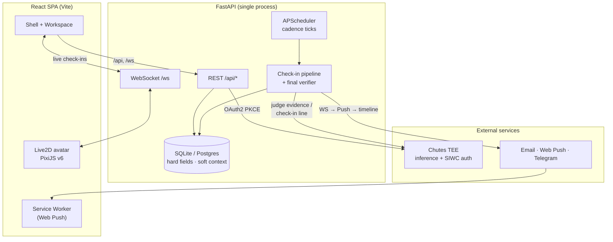

<a id="readme-top"></a>

<!-- PROJECT BANNER -->
<div align="center">
  

  <h3>Kawan</h3>

  <p>
    <b>A skeptical accountability companion. Not a cheerleader.</b><br />
    One commitment, verified evidence, no self-report. Earn the trust.
  </p>

  <!-- Tech badges -->


  <!-- Quick links -->

[Watch the Demo](https://youtu.be/B3u5ByG_-jk?si=akg3RFeiuUoWNiXA) · [Devpost](https://devpost.com/software/kawan) · [Pitch Deck](https://github.com/kawan-chjl/dev/blob/main/kawan/docs/kawan-pitch-deck.pdf) · [Live App](https://kawan-frontend.vercel.app)

</div>

<!-- TABLE OF CONTENTS -->

## Table of Contents

<details>
  <summary>Expand</summary>
  <ol>
    <li><a href="#about-the-project">About The Project</a></li>
    <li><a href="#screenshots">Screenshots</a></li>
    <li><a href="#how-it-works">How It Works</a></li>
    <li><a href="#features">Features</a></li>
    <li>
      <a href="#architecture">Architecture</a>
      <ul>
        <li><a href="#the-trust-boundary">The trust boundary</a></li>
        <li><a href="#the-check-in-pipeline">The check-in pipeline</a></li>
      </ul>
    </li>
    <li><a href="#tech-stack">Tech Stack</a></li>
    <li>
      <a href="#getting-started">Getting Started</a>
      <ul>
        <li><a href="#prerequisites">Prerequisites</a></li>
        <li><a href="#installation">Installation</a></li>
      </ul>
    </li>
    <li><a href="#configuration">Configuration</a></li>
    <li><a href="#deployment">Deployment</a></li>
    <li><a href="#project-structure">Project Structure</a></li>
    <li><a href="#license">License</a></li>
    <li><a href="#team">Team</a></li>
    <li><a href="#acknowledgments">Acknowledgments</a></li>
  </ol>
</details>

<!-- ABOUT THE PROJECT -->

## About The Project

> _"It doesn't believe you. Yet."_

Most habit apps take you at your word. Tap a checkbox, keep the streak, lie to yourself for free. **Kawan** _(Malay for "friend")_ is the opposite: a companion that holds you to **one commitment**, asks for **real evidence**, and only believes you once you've shown it.

You commit to a single deliverable with a deadline. Kawan checks in on a schedule, reviews the evidence you submit — a screenshot, a file, or commits in a GitHub repo — and returns a verdict: **pass**, **fail**, or **unclear**. Self-report is never accepted. Trust is earned check-in by check-in.

The catch that makes it work: **Kawan can never change the terms of your deal.** Your goal, deadline, and how you're verified are yours alone. The AI reads them, reasons about them, and nudges you — but it is structurally incapable of editing them. That guarantee is enforced in the schema, not just the prompt (see [The trust boundary](#the-trust-boundary)).

It's wrapped in a warm, expressive interface: pick one of three **Live2D companions**, each with a distinct personality, voice, and model line-up, who reacts to your progress in real time.

<p align="right"><a href="#readme-top">&uarr;</a></p>

<!-- SCREENSHOTS -->

## Screenshots

|                                                       Landing                                                       |                                                            Sign in                                                             |
| :-----------------------------------------------------------------------------------------------------------------: | :----------------------------------------------------------------------------------------------------------------------------: |
|            |  |
|                                                   **Guided tour**                                                   |                                                            **Home**                                                            |
|  |                        |
|                                                   **Commitments**                                                   |                                                         **Analytics**                                                          |
|    |         |

<p align="right"><a href="#readme-top">&uarr;</a></p>

<!-- HOW IT WORKS -->

## How It Works

A commitment moves through a single, deterministic lifecycle — from drafting the deal to a verified (or honestly un-verified) outcome.

### 1. Compose — state the deal

`I will [complete] [a deliverable] by [a deadline].` One goal, one deadline. No room to be vague.


### 2. Plan — set the terms

Choose your evidence source (a GitHub repo to watch, or screenshot/file uploads), optionally name a **witness** who gets emailed if you miss, and a reminder email. _Only you can change these. Kawan reads them but never edits them._


### 3. Companion — pick who holds you to it

Three personalities, same backbone:

|  Companion   |      Archetype      | Tone                                                            |
| :----------: | :-----------------: | --------------------------------------------------------------- |
|  **Kawan**   | Skeptical Concierge | Candid, warm, slightly dry. Believes you because you proved it. |
|   **Adik**   | Gentle Cheerleader  | Encouraging and kind. Celebrates every step.                    |
| **Cik Maid** | Playful Taskmaster  | Brisk, playful, expects results — with a wink.                  |


### 4. Check in — answer to your companion

Your companion enters the workspace as a live, animated avatar. It gathers context (why, obstacles, time), then checks in on schedule and waits for evidence.


### 5. Workspace — context, plan & evidence in one place

A focused room around the conversation: captured context, an advisory plan, recent activity, a live countdown to the next check-in, and the **Submit final evidence** action.


### 6. Track — overview, progress & terms

Every commitment has a detail page: verified count, check-ins, latest verdict and reasoning, the immutable terms, and a full timeline.


### 7. Finish — verified, and only then

When the evidence passes, the commitment is closed as done. No participation trophies — a win counts because it was shown.


<p align="right"><a href="#readme-top">&uarr;</a></p>

<!-- FEATURES -->

## Features

- 🎯 **One real commitment** — a single action + deliverable + deadline. Hard fields you set and only you can change.
- 🔎 **Evidence over self-report** — verdicts come from a GitHub repo's commits, an uploaded file, or a screenshot judged by a vision model. There is no "mark as done" button you can lie to.
- ⚖️ **Honest verdicts** — every check-in resolves to `pass` / `fail` / `unclear`. `unclear` never punishes; a flaky or slow model degrades to it instead of guessing.
- 🎭 **Three Live2D companions** — Kawan, Adik, and Cik Maid, each a stateless preset of tone + animated model + voice + inference model. Switching the companion changes the messenger, never your commitment.
- 🔐 **TEE inference via Chutes** — real check-in lines and evidence judgments run on Chutes' Trusted Execution Environment chutes, with per-persona model routing and an automatic secondary judge on failure. A deterministic offline **stub** backend runs the whole app with zero keys.
- 🪜 **Reliable delivery** — notifications walk a ladder: live **WebSocket** → **Web Push** → persisted **in-app timeline**, so a check-in is never lost.
- 📣 **Off-device reminders** — opt-in **email** (Resend), **Web Push** (VAPID), and a **Telegram** check-in channel.
- 🤝 **Stakes & witnesses** — name someone who's emailed if you miss the deadline. That's the whole mechanism.
- 📈 **Analytics & achievements** — a productivity meter, identity titles, and 15 behavioral achievements that reward _how_ you won (verified without a skip-day, finished early, came back after a miss…).
- ⏰ **Scheduled & on-demand check-ins** — APScheduler drives the cadence; one code path serves both the cron tick and an instant "check now," and rebuilds its jobs from the DB after a restart.
- 🪶 **Guided walkthrough** — an optional tour that teaches the commitment flow on real components, not a fake demo.
- 🌗 **Polished UX** — light/dark themes, responsive shell, optional Piper neural TTS with a WebSpeech fallback.

<p align="right"><a href="#readme-top">&uarr;</a></p>

<!-- ARCHITECTURE -->

## Architecture

Kawan is a **single-process FastAPI backend** plus a **React SPA**. The frontend is organized in three zones: public pages (Zone 0), the SaaS shell (Zone 1 — home, commitments, analytics, settings), and the full-screen AI workspace (Zone 2 — the compose flow and live companion).



### The trust boundary

The core idea is a hard separation between what **you** own and what the **AI** can touch — enforced in the data model, not just convention:

- **Hard fields** (`commitments` table): action, deliverable, deadline, cadence, evidence type, stake. Written only by GUI handlers and the scheduler/verifier. **No AI code path can update them.**
- **Soft context** (`soft_context` table): the _why_, obstacles, and constraints. The **only** table the AI is allowed to write.
- **Proposals**: the AI can _propose_ a change to a hard field, but only **you** can apply it.
- **Audit log**: every hard-field mutation records an actor — and `'ai'` is **unrepresentable** by a database `CHECK` constraint. The AI literally cannot be the author of a change to your deal.

That is why the UI can promise _"Only you can change these. Kawan reads them but never edits them."_ and mean it.

### The check-in pipeline

One code path (`app/pipeline.py`) runs for both a scheduled cadence tick and an on-demand check:

1. **Fetch** new evidence through the adapter for the commitment's evidence type (`github` / `screenshot` / `file`).
2. **Judge** it into a `Verdict` (`pass` / `fail` / `unclear`) — primary call on a Chutes TEE model, with a bounded timeout that **fails fast to a secondary judge** rather than hanging.
3. **Persist** the evidence, check-in line, and escalation state.
4. **Deliver** down the ladder: **WebSocket → Web Push → in-app timeline**.

A commitment's status machine (`draft → active → verifying → grace → completed / missed`, plus `lapsed` / `returned`) is the only thing that moves state — derived snapshots feed the AI as read-only prompt context and can never write back.

<p align="right"><a href="#readme-top">&uarr;</a></p>

<!-- TECH STACK -->

## Tech Stack

| Layer                 | Technologies                                                                                                   |
| --------------------- | -------------------------------------------------------------------------------------------------------------- |
| **Frontend**          | React 18 · TypeScript · Vite · React Router v7 · PixiJS v6 + `pixi-live2d-display` · Recharts · Lucide · Biome |
| **Backend**           | FastAPI · SQLAlchemy 2 (async) · APScheduler · Pydantic Settings · httpx · `uv`                                |
| **Database**          | SQLite (dev) · PostgreSQL via Supabase pooler (prod)                                                           |
| **AI / Inference**    | Chutes (OpenAI-compatible TEE inference) + Sign in with Chutes (OAuth2 PKCE) · deterministic stub backend      |
| **Realtime / Notify** | WebSocket · Web Push (VAPID) · Telegram Bot API · Email (Resend)                                               |
| **Avatars / Voice**   | Live2D Cubism (Haru, Hiyori, LiveroiD) · Piper neural TTS (optional)                                           |
| **Deploy**            | Backend on Render · Frontend on Vercel                                                                         |

<p align="right"><a href="#readme-top">&uarr;</a></p>

<!-- GETTING STARTED -->

## Getting Started

The app runs **fully offline out of the box** — the default AI backend is a deterministic stub, so you need no API keys to try it locally.

### Prerequisites

- **Python 3.12+** and [`uv`](https://docs.astral.sh/uv/)
- **[Bun](https://bun.sh/)** (the frontend lockfile is `bun.lock`; npm/pnpm also work)
- A POSIX shell (the asset scripts are bash)

### Installation

**1. Configure the environment**

```bash
cp .env.example .env          # in the kawan/ folder; sensible dev defaults are pre-filled
```

The dev defaults use local SQLite, the Vite proxy, and `KAWAN_AI_BACKEND=stub`. No secrets required.

**2. Fetch the Live2D companion models** (gitignored; one-time after clone)

```bash
./scripts/download_models.sh  # Haru + Hiyori auto-download; LiveroiD is a manual BOOTH step
```

**3. Run the backend** (FastAPI on `:8000`)

```bash
cd backend
uv sync
uv run uvicorn app.main:app --reload
```

**4. Run the frontend** (Vite on `:5173`, proxies `/api` and `/ws` to the backend)

```bash
cd frontend
bun install
bun dev
```

Open **http://localhost:5173** and choose **Continue as guest** to start.

> **Optional — voices:** run `./scripts/download_voices.sh` to fetch the three Piper persona voices. Without them, the frontend falls back to the browser's WebSpeech voice.

<p align="right"><a href="#readme-top">&uarr;</a></p>

<!-- CONFIGURATION -->

## Configuration

All settings use the `KAWAN_` prefix and load from `kawan/.env`. See [`.env.example`](https://github.com/kawan-chjl/dev/blob/main/kawan/.env.example) for the fully annotated list. The most important knobs:

| Variable                                    | What it does                                                                      |
| ------------------------------------------- | --------------------------------------------------------------------------------- |
| `KAWAN_AI_BACKEND`                          | `stub` (deterministic, offline — default) or `chutes` (real TEE inference)        |
| `KAWAN_DATABASE_URL`                        | SQLite by default; a Supabase pooler URL in prod                                  |
| `KAWAN_CHUTES_API_KEY`                      | Chutes token — enables guest-mode inference and app registration                  |
| `KAWAN_SIWC_*`                              | Sign in with Chutes (OAuth2 PKCE) client credentials                              |
| `KAWAN_SESSION_SECRET` / `KAWAN_FERNET_KEY` | Cookie signing + token-at-rest encryption (must be set in prod)                   |
| `KAWAN_VAPID_*`                             | Web Push keypair — blank disables push (delivery falls back to the timeline)      |
| `KAWAN_RESEND_API_KEY`                      | Stake/reminder email — blank uses a log-only outbox so the miss path still runs   |
| `KAWAN_TELEGRAM_BOT_TOKEN`                  | Telegram check-in channel — blank makes every send a no-op                        |
| `KAWAN_PIPER_VOICES_DIR`                    | Directory of Piper voice models — blank returns 204 and the client uses WebSpeech |

To use **real inference**, set `KAWAN_AI_BACKEND=chutes` and provide `KAWAN_CHUTES_API_KEY` (and the `KAWAN_SIWC_*` values for Sign in with Chutes).

<p align="right"><a href="#readme-top">&uarr;</a></p>

<!-- DEPLOYMENT -->

## Deployment

- **Backend → Render.** [`backend/render.yaml`](https://github.com/kawan-chjl/dev/blob/main/kawan/backend/render.yaml) defines the web service (`uv sync` → `uvicorn`). Secrets and the cross-origin cookie settings (`KAWAN_COOKIE_SAMESITE=none`, `KAWAN_COOKIE_SECURE=true`) are set in the Render dashboard. Database notes (Supabase session vs. transaction pooler) live in [`backend/DEPLOY.md`](https://github.com/kawan-chjl/dev/blob/main/kawan/backend/DEPLOY.md).
- **Frontend → Vercel.** [`frontend/vercel.json`](https://github.com/kawan-chjl/dev/blob/main/kawan/frontend/vercel.json) rewrites `/api/*` to the Render backend and serves the SPA. In production the WebSocket connects directly to Render, which is why prod runs `SameSite=None; Secure` cookies.

<p align="right"><a href="#readme-top">&uarr;</a></p>

<!-- PROJECT STRUCTURE -->

## Project Structure

```text
kawan/
├── backend/             # FastAPI single-process service
│   ├── app/
│   │   ├── main.py      # app + lifespan (scheduler, telegram poller)
│   │   ├── models.py    # hard fields / soft context / audit log
│   │   ├── pipeline.py  # check-in + final verify (the one code path)
│   │   ├── personas.py  # Kawan / Adik / Cik Maid presets
│   │   ├── adapters/    # github · screenshot · file evidence
│   │   ├── routes/      # auth · commitments · push · telegram · voice · ws
│   │   └── …            # scheduler, chutes client, notify, state machine
│   ├── render.yaml      # Render deploy
│   └── DEPLOY.md        # DB / pooler notes
├── frontend/            # React + Vite SPA
│   ├── src/
│   │   ├── shell/       # Zone 1 — SaaS shell + pages
│   │   ├── zone2/       # Zone 2 — workspace, Live2D, new-commitment flow
│   │   ├── timeline/    # analytics, achievements, productivity meter
│   │   └── …            # auth, notifications, ui, share
│   └── public/          # Live2D models, banner, icons, service worker
├── scripts/             # download_models.sh · download_voices.sh · helpers
├── docs/screenshots/    # the images in this README
└── .env.example         # annotated configuration
```

<p align="right"><a href="#readme-top">&uarr;</a></p>

<!-- LICENSE -->

## License

Distributed under the MIT License. See [LICENSE](https://github.com/kawan-chjl/dev/blob/main/kawan/LICENSE) for details.

<p align="right"><a href="#readme-top">&uarr;</a></p>

<!-- TEAM -->

## Team

Built by **Team CHJL** with 💖 for Chutes Hack Malaysia 2026.

<div align="center">
<table>
  <tr>
    <td align="center" width="25%">
      <a href="https://github.com/AlaskanTuna"></a><br />
      <b>ZJ</b><br />
      <a href="https://github.com/AlaskanTuna">@AlaskanTuna</a>
    </td>
    <td align="center" width="25%">
      <a href="https://github.com/kymil4"></a><br />
      <b>YK</b><br />
      <a href="https://github.com/kymil4">@kymil4</a>
    </td>
    <td align="center" width="25%">
      <a href="https://github.com/WhiteAvocad0"></a><br />
      <b>Jeremy</b><br />
      <a href="https://github.com/WhiteAvocad0">@WhiteAvocad0</a>
    </td>
    <td align="center" width="25%">
      <a href="https://github.com/c3638"></a><br />
      <b>KH</b><br />
      <a href="https://github.com/c3638">@c3638</a>
    </td>
  </tr>
  <tr>
    <td align="center"><sub>Frontend, the Live2D companion stage, and the workspace UI.</sub></td>
    <td align="center"><sub>Backend core: auth, billing, the scheduler, and realtime.</sub></td>
    <td align="center"><sub>The AI agent layer, Chutes integration, and evidence judging.</sub></td>
    <td align="center"><sub>Voice, notifications, deployment, and demo integration.</sub></td>
  </tr>
</table>
</div>

<p align="right"><a href="#readme-top">&uarr;</a></p>

<!-- ACKNOWLEDGMENTS -->

## Acknowledgments

- [Chutes](https://chutes.ai) — Trusted Execution Environment inference and Sign in with Chutes
- [Live2D Cubism](https://www.live2d.com/) & [pixi-live2d-display](https://github.com/guansss/pixi-live2d-display) — the animated companions
- [Piper](https://github.com/rhasspy/piper) — neural text-to-speech voices
- [Shields.io](https://shields.io) — the badges above

<p align="right"><a href="#readme-top">&uarr;</a></p>
